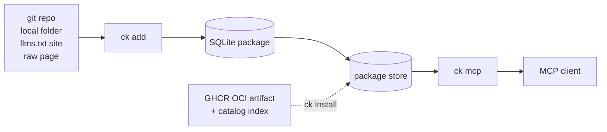

# ContextKit

**Documentation packages your AI agent can hold locally — no hosted docs API on the hot path.**

[](https://www.nuget.org/packages/ContextKit) [](https://github.com/mehdihadeli/groundkit/actions/workflows/build-and-publish.yml)

ContextKit is a .NET CLI and MCP server. It turns documentation into a portable
package, keeps that package in a local store, and answers agent queries from
SQLite full-text search. You build a package once for a specific source
snapshot; after that, queries cost nothing but disk reads.

It exists because the usual arrangement — agent fetches a docs website, parses
HTML, chunks it on the fly — is slow, breaks when the site changes, and keeps
paying network and token costs for the same pages. ContextKit moves that work to
build time and keeps retrieval local.

| | |
| --- | --- |
| Runtime | .NET 10 |
| Transport | MCP over stdio (default) and Streamable HTTP |
| Storage | One SQLite `.db` per package |
| Retrieval | FTS5/BM25 by default; optional local semantic or hybrid search |
| Sources | Git repo, local folder, `llms.txt` site, raw page, existing `.db` |
| Install | `dotnet tool install --global ContextKit` |

## The two phases

ContextKit is easier to reason about as two separate stages.

**Build (offline).** `ck add` resolves a source, discovers the docs
folder, extracts text, splits it into sections, fingerprints the content, and
writes a single SQLite file. Nothing about the query path is decided here except
what the package contains.

**Query (on demand).** `ck mcp` starts a server that looks up installed
packages and searches them. Queries are answered from disk; the only time the
server reaches the network is when you ask a question about a package that is
not installed yet and it is published — see `ask-docs` below.



The dotted edge is optional: a package can also arrive prebuilt from a registry
instead of being built locally.

## Local by design

ContextKit runs on your machine and answers from a file it keeps there, not from
a hosted service. That changes what retrieval costs and what can go wrong with
it.

- **No round trip per question** — FTS5 searches the local SQLite file directly,
  so latency is disk speed rather than network speed.
- **Nothing to authenticate** — Queries need no API key, account, or hosted
  service, and query text never leaves the machine.
- **Works disconnected** — A plane, a coffee shop, or a corporate firewall that
  blocks a vendor's docs site changes nothing.
- **Costs the same every time** — No subscription, no rate limit, no per-query
  retrieval charge. The same package returns the same ranking.
- **Can't be withdrawn** — The evidence is a file you own, so an upstream
  retrieval API changing or shutting down does not affect your agents.

Only three operations touch the network: catalog search, registry download, and
a build from a remote source. Optional semantic setup also downloads its provider
and model explicitly; embedding generation and semantic queries stay local.

## Getting started

Requirements: the .NET 10 SDK, and Git if you plan to build from a repository.

Install the CLI:

```bash
dotnet tool install --global ContextKit    # tool command: ck
```

New releases use the `ContextKit` package identity. Existing installations of
the former `GroundKit` package do not change automatically; install `ContextKit`
and update shell commands and MCP client configurations to `ck`.

Working from a clone instead? The repository root includes launchers for the
same command under both names — `ck`, `ck.ps1`, and `ck.cmd`, plus the
long-form `groundkit` variants — that run the source tree through `dotnet run`.
Put the root on `PATH` for the session:

```bash
export PATH="$PWD:$PATH"        # bash and other POSIX shells
```

```powershell
$env:Path = "$PWD;$env:Path"    # PowerShell
```

Then get one package in place and confirm it landed:

```bash
ck add react             # build from the curated catalog
# or
ck install npm/react     # pull the prebuilt package from the registry

ck list
ck query react "useEffect cleanup"
```

`ck list` reads only the local store, so it works with no network. The
same is true of `query` once a package is installed, unless you leave
auto-install enabled and the package is missing. A question can also name the
package instead of you naming it:

```bash
ck query "what are components in angular?"
```

## Connecting an MCP client

Point the client at `ck mcp` over stdio. Most clients take the same
server block; only the file location differs.

| Client | Config file |
| --- | --- |
| VS Code (GitHub Copilot) | `.vscode/mcp.json` in the workspace |
| GitHub Copilot CLI | `~/.copilot/mcp-config.json` |
| Claude Code | `claude mcp add ck -- ck mcp` |
| Claude Desktop | `%APPDATA%\Claude\claude_desktop_config.json` (Windows), `~/Library/Application Support/Claude/` (macOS), `~/.config/claude/` (Linux) |
| Cursor | `~/.cursor/mcp.json` or `.cursor/mcp.json` |
| Windsurf | `%USERPROFILE%\.codeium\windsurf\mcp_config.json` |
| Zed | `settings.json`, under `context_servers` |

```json
{
  "mcpServers": {
    "groundkit": {
      "command": "ck",
      "args": ["mcp"]
    }
  }
}
```

The MCP server also ships as its own tool shim, `groundkit-mcp`, if you prefer a
single-purpose executable in client config.

For HTTP transport — several clients, one server, or a container:

```bash
ck mcp --http 4000 --host 0.0.0.0
```

The endpoint is `http://<host>:<port>/mcp`. Clients that speak streamable HTTP
can point straight at the URL instead of spawning a process.

To pin a session to specific packages, pass `--libs`:

```bash
ck mcp -l react,vite
ck mcp -l 'nextjs@16.0'
```

A bare name exposes every installed version; `name@version` exposes exactly one.

## Command reference

| Command | Aliases | Purpose |
| --- | --- | --- |
| `add <source>` | `a` | Build and install a package from a source |
| `install <name\|source> [version]` | `i` | Install prebuilt if possible, otherwise build |
| `search-packages <registry> <name> [version]` | `sp`, `search` | Read registry metadata |
| `download-package <registry> <name> <version>` | `dp`, `dl` | Download one exact artifact, no fallback |
| `list` | `l`, `ls` | Show installed packages and totals |
| `inspect <id>` | `ins`, `info` | Show metadata, source, and `.db` path |
| `query <library> <topic>` | `q` | Search one package from the terminal |
| `query "<question>"` | `q` | Detect the package from the question, then search |
| `refresh <id>` | `rf`, `ref` | Rebuild from the recorded source |
| `remove <name[@version]>` | `rm`, `del` | Delete one installed version |
| `import <file>` | `im` | Load a portable `.db` |
| `export <id> <destination>` | `ex`, `exp` | Write a portable `.db` |
| `catalog [query]` | `c`, `cat` | List curated sources |
| `mcp` | — | Start the MCP server |
| `registry <subcommand>` | — | Maintainer tooling for package definitions |

Shared options: `--path`/`-p`, `--name`/`-n`, `--pkg-version`/`-v`,
`--save`/`-s`, `--tag`/`-t`, `--choose-tag`/`-c`.

### Building a package

Not everything belongs in a public registry. Use `add` for private
repositories, internal runbooks and design systems, or a library the catalog
carries in an older version than you depend on. `add` always builds from source
and never queries the catalog, so the package is produced and stored locally and
your source never has to be published.

```bash
ck add react
ck add https://github.com/mattpocock/skills
ck add ./skills
ck add https://agentgateway.dev
ck add ./packages/react@19.1.0.db
```

For a directory or repository, ContextKit picks the docs folder automatically. It
looks at `docs/`, `documentation/`, `doc/`, `website/docs/`, `guides/`,
`guide/`, `manual/`, `reference/`, `content/`, and `wiki/`, and chooses whichever
holds the most supported files. Override it when the guess is wrong:

```bash
ck add ./skills --path skills
ck add https://github.com/vuejs/docs --docs-path src
```

For git sources, ContextKit uses the latest stable SemVer tag. Pin or pick
explicitly when you need reproducible packages:

```bash
ck add https://github.com/mattpocock/skills --tag v1.2.3
ck add https://github.com/mattpocock/skills --choose-tag
ck add https://github.com/mattpocock/skills/tree/v1.2.3
```

Clones go to a temporary directory and are cleaned up whether the build succeeds
or fails. Set identity explicitly when you want the package id to differ from the
source name:

```bash
ck add ./skills --path docs --name mattpocock-skills --pkg-version 1.0.0
```

### Querying

```bash
ck query react "useEffect cleanup"
ck query 'nextjs@16.0' 'middleware authentication'
ck query vue "composition api" --pretty
ck query vue "composition api" --no-install
```

Skip the package name entirely and ask a question, and `query` works out which
package you mean:

```bash
ck query "how do i add request interceptors in axios?"
```

Detection runs against what is installed first and the curated catalog second,
so a local copy always wins over a download. It matches the words of the
question rather than demanding an exact id: `next.js` and `Next JS` are the same
name, common aliases such as `angularjs` and `nest` are recognised, and a small
typo like `angualr` is forgiven. An explicitly named package beats a near miss,
so `next steps in angualr` is read as `next`. When the question names nothing
known, the command exits with `1` and lists the installed packages and the
`ck add` commands that would make one queryable.

`query` prints the same JSON shape as the MCP `get_docs` tool, or rendered panels
with `--pretty`. If the package is installed it stays local. If it is published
but not installed, `query` downloads it first; `--no-install` disables that and
reports how to add the package instead.

`library@version` selects an exact installed version. A bare name takes the
newest one. `remove` behaves the same way: with several versions installed, a
bare name lists them and asks which to delete, so nothing disappears by
accident.

### Search modes

Choose how ContextKit ranks sections independently of how it finds the library:

| Mode | Retrieval | When to use it | Setup |
| --- | --- | --- | --- |
| `lexical` | SQLite FTS5/BM25 | API names, flags, error codes, quoted phrases | None; default |
| `semantic` | Local embedding similarity | Paraphrases that use different words from the docs | Optional provider and model |
| `hybrid` | BM25 and embeddings combined by reciprocal-rank fusion | Questions that mix identifiers and descriptions | Optional provider and model |

The standard install stays independent of ONNX Runtime, Semantic Kernel, and model
weights. Lexical search works immediately after adding a documentation package:

```bash
dotnet tool install --global ContextKit
ck add react
ck query react "useEffect cleanup" --search-mode lexical
```

To try semantic or hybrid search, install the optional assets once:

```bash
ck semantic provider install onnx
ck semantic model install bge-micro-v2

ck query react "stop background work after component removal" --search-mode semantic
ck query react "stop background work after component removal" --search-mode hybrid
```

Installing assets does not change the default. `--search-mode` selects one query;
omit it to use the configured default. To make hybrid search the default:

```bash
ck semantic enable --model bge-micro-v2 --mode hybrid
ck semantic status
ck query react "stop background work after component removal"
ck query react "useEffect" --search-mode lexical
ck semantic disable
```

`enable` verifies the worker/model and indexes installed packages before changing
the default for CLI and MCP. Newly added or changed packages are indexed on their
first semantic query; `ck semantic index react` prepares one explicitly. That first
index can take longer than subsequent queries. An explicit mode overrides the
configured default; missing setup is an error, not a silent fallback. MCP query
tools accept the same override as `searchMode`. Use `--mode semantic` instead to
make embedding-only search the default. `disable` restores lexical search without
removing installed assets.

The initial supported model is pinned, quantized BGE Micro V2: English, 384
dimensions, MIT, approximately 17.6 MB including vocabulary and license. Models
must match a tested tokenizer and pooling profile; arbitrary ONNX files are not
supported. Portable documentation databases remain unchanged; vectors live in
separate caches keyed by package contents and model profile.

Setup is stored under `GROUNDKIT_HOME/semantic`, or `~/.groundkit/semantic` when
unset. Provider downloads use matching ContextKit release assets for Windows x64,
Linux x64, macOS x64, and macOS arm64. Source builds can import a trusted local
bundle with `--bundle`; see [CLI reference](docs/reference/cli.md). Queries do not
download the provider or model, and local inference needs no API key, Docker, or
Ollama. Neither optional mode has been shown to outperform BM25 on a shared
documentation benchmark.

See [Search mode guide](docs/guide/grounding.md#choosing-a-search-mode) for setup,
indexing, mode overrides, and troubleshooting, and
[MCP search modes](docs/reference/mcp-tools.md#search-modes) for tool arguments.

### The MCP tool surface

| Tool | Purpose |
| --- | --- |
| `query-docs` | Search an installed package under a token budget |
| `ask-docs` | Ask a question without naming a package; detects it, downloads it if published, then searches |
| `get_docs` | Context7-compatible alias for `query-docs` |
| `resolve-source` | Match installed packages by id or display name |
| `library_catalog` | List curated sources |
| `search_packages` | Search a compatible registry |
| `download_package` | Download a registry package and import it |

Documentation results come back twice: structured content for MCP-aware clients,
and a compact plain-text rendering for agents that read tool output as prose.
When a package is not installed, `query-docs` and `get_docs` answer with what
they can see locally, what the registry offers, and the exact `ck install`
command; they do not download anything themselves. `ask-docs` is the one tool
that installs, and only the package it detected from the question.
See [docs/reference/mcp-tools.md](docs/reference/mcp-tools.md).

## Documentation sources

The catalog is a starting point, not a boundary. Anything you can point at — a
private repository, an internal runbook, an unpublished design system, a site
that publishes `llms.txt`, or a single blog post — can become a local package.

| Source | What ContextKit does |
| --- | --- |
| Git repository | Clones the repo at a tag or branch, finds the docs folder, indexes it |
| Local directory | Reads the folder in place; no clone, no cleanup |
| `llms.txt` site | Probes `/llms-full.txt`, then `/llms.txt`; follows index links when needed |
| Any URL | Falls back to fetching the page and reducing HTML to article content |
| Package file | Imports an existing `.db` instead of building |

Markdown, MDX, HTML, and other text formats are indexed as-is; HTML pages lose
navigation, CTAs, and comment widgets before indexing.

Two warnings are worth knowing about. If a source yields no supported files, the
build still produces a package but warns and includes a search link for locating
the right documentation repository. A package with very few sections gets a
similar warning, because that usually means the docs live somewhere else — many
projects keep them in a separate repo.

## Package files and the local store

A package is a single SQLite database. That makes it easy to move, inspect, and
back up.

- Default store: `.groundkit/packages` in the working tree, or
  `GROUNDKIT_HOME/packages` when that variable is set.
- `ck list` shows ids, versions, sizes, document counts, and section
  counts.
- `ck inspect <id>` shows metadata, the recorded source, and the path to
  the database file.
- `ck refresh <id>` rebuilds from the recorded source.
- `ck export <id> <dir>` and `ck import <file>` move packages
  between machines without a rebuild.

### Replacing an installed package

Builds and downloads are verified before they reach the store. A registry
download is written to a temporary file, checked against the catalog's size and
SHA-256, and only then moved into place. A failed build or failed check leaves
the previously installed package intact, and temporary files are excluded from
package discovery.

Store names come from the package's own identity rather than the incoming file
name, so re-installing the same id and version replaces that single entry
instead of storing a duplicate. If the operating system refuses to replace a
file that is still open — on Windows, usually a reader holding the SQLite file —
close the reader and rerun the command.

## Installing from the registry

Prebuilt packages save you a clone and a build. The catalog is a static
`index.json` on GitHub Pages that maps each package to a GHCR OCI manifest
digest, its byte size, and its SHA-256. A consumer resolves the digest, downloads
one layer, verifies it, and imports it. Reads are anonymous and there is no
server to run.

The catalog is built from declarative YAML definitions contributed to this
repository, one file per library. CI turns each definition into a package and
publishes it, so no one has to trust a hand-uploaded file.

```bash
ck search-packages npm axios
ck install npm/axios
ck download-package npm/react 19.1.0
```

`install` resolves in this order:

1. A matching package in the local store — no network request at all.
2. A registry match — download the artifact, verify size and SHA-256, import it.
3. No registry match, or the registry is unreachable — build from the catalog
   entry or the source you supplied.

A registry that responds but serves a broken artifact (missing manifest, size or
checksum mismatch) is treated as an error. That is a broken catalog entry, not a
missing package, so `install` does not quietly fall back to a build.
`download-package` is the strict path when only a registry artifact will do.

Bare names default to `npm`, and a name with a version pins the exact artifact:

```bash
ck install react                 # npm/react
ck install npm/angular 20.3.15
ck query 'angular@20.3.15' 'component lifecycle'
```

The starter catalog covers 19 JavaScript and web libraries. Definitions live in
`registry/npm/`:

| Category | Libraries |
| --- | --- |
| Frameworks | Next.js, NestJS, Vue, Angular |
| React ecosystem | React, Vite, Vitest |
| Backend and APIs | Express, Fastify, GraphQL, Zod |
| Styling | Tailwind CSS |
| Tooling | TypeScript, ESLint, Prettier |
| Data and testing | Axios, Jest, Playwright, VitePress |

A library that is missing is a YAML file away — see
[Contributing a definition](#contributing-a-definition).

### Contributing a definition

Definitions are declarative, so adding a library does not mean patching the
builder. One file describes where the docs live and which ref to build:

```yaml
# registry/npm/react.yaml
name: react
description: "User interface library"
repository: https://github.com/reactjs/react.dev
source:
  type: git
  url: https://github.com/reactjs/react.dev
  docs_path: src/content
```

Validate and build it locally before opening a pull request:

```bash
ck registry validate --dir registry
ck registry build react --dir registry --output ./dist-packages
```

Once merged, the Registry Update workflow builds the definition, pushes the
result to GHCR as a content-addressed OCI artifact, and records the manifest
digest in the catalog. From then on `ck install npm/react` serves it, and every
consumer verifies the same bytes. Publishing runs only from merged definitions
on the default branch, never from contributor pull requests.

### Pointing at another catalog

Set the address per project in `.groundkit/config.json`:

```json
{
  "RegistryUrl": "https://registry.example.com",
  "HttpHeaders": {
    "Authorization": "Bearer replace-me"
  }
}
```

`GROUNDKIT_REGISTRY_URL` overrides the file, and `--registry-url <url>` overrides
both for a single invocation. `HttpHeaders` is for private registries; keep
credentials out of committed files.

## Sharing packages

Packages are just files, so a team can pass them around directly:

```bash
# Build once, keep a copy
ck add ./skills --name mattpocock-skills --pkg-version 1.2.3 \
  --save ./artifacts/mattpocock-skills@1.2.3.db

# A teammate imports it — no clone, no build
ck install ./mattpocock-skills@1.2.3.db
ck install https://packages.example.com/mattpocock-skills@1.2.3
```

`--save` accepts a file or a directory; for a directory, the installed package
filename is used. Hosting the `.db` behind any HTTP server is enough — no
ContextKit-specific server is required. Note that a direct `.db` URL skips the
catalog's checksum verification.

## Running in Docker

```bash
docker compose up --build mcp         # http://localhost:8081/mcp
docker compose run --rm -i mcp-stdio  # stdio, no published port
```

Both services set `GROUNDKIT_HOME=/data` and share the `mcp-data` volume. The
image runs the HTTP transport by default; `mcp-stdio` exists for clients that
launch containers as subprocesses. Either way, packages must already be in the
mounted store — the server does not download during queries.

## Registry maintainer commands

`ContextKit.Registry` is a command library hosted inside the same CLI, not a
separate executable.

```bash
ck registry list --dir registry
ck registry validate --dir registry
ck registry build react --dir registry --output ./dist-packages
ck registry build-all --dir registry --output ./dist-packages
ck registry push-oci --dir registry --output ./dist-packages \
  --oci-repository ghcr.io/OWNER/REPOSITORY --oci-references ./oci-references.json
ck registry catalog-index --dir registry --output ./dist-packages --oci-references
ck registry bundle --output ./dist-packages --format zip
ck registry import-bundle ./dist-packages/groundkit-registry.zip --output ./imported
```

| Subcommand | Aliases | Purpose |
| --- | --- | --- |
| `list` | `l`, `ls` | Discover definitions |
| `validate` | `v`, `val` | Check definitions locally and in CI |
| `build` | `b` | Build one definition |
| `build-all` | `ba` | Build every definition |
| `push-oci` | `po` | Publish packages to an OCI registry |
| `bundle` | `bd`, `bun` | Produce an offline archive |
| `import-bundle` | `ib` | Extract an archive |
| `catalog-index` | — | Generate the catalog the CLI consumes |

Publishing authenticates with `GROUNDKIT_OCI_USERNAME` and
`GROUNDKIT_OCI_TOKEN`, falling back to `GITHUB_TOKEN` and `GITHUB_ACTOR`. With
neither set, the client reads the target host's Docker credential entry, so CI
can log in with `docker/login-action` instead of exporting a token.

The [Registry Update workflow](.github/workflows/registry-update.yml) runs
validation and builds on the default branch, pushes content-addressed OCI
artifacts to GHCR, and generates the catalog the docs workflow serves from
Pages. Publishing only happens from merged definitions, never from contributor
PRs. Full sequence: [src/ContextKit.Registry/README.md](src/ContextKit.Registry/README.md).

## Working on ContextKit

```bash
dotnet build
dotnet test
dotnet tool restore
dotnet run --project src/ContextKit.Cli -- list
```

`ContextKit.slnx` gathers the projects: `ContextKit.Abstractions` (shared records
and interfaces), `ContextKit.Core` (source detection, ingestion, package builds,
observability, OCI), `ContextKit.Storage.Sqlite` (persistence, FTS5, BM25),
`ContextKit.Hosting` (DI composition and shared MCP startup), `ContextKit.Mcp`
(reusable tools, deterministic formatting, transports), `ContextKit.Mcp.Host`
(the `groundkit-mcp` tool), `ContextKit.Registry` (maintainer commands),
`ContextKit.ServiceDefaults`, `ContextKit.Semantic.Onnx` (optional worker), and
`ContextKit.Cli` (the `ck` tool). Tests live under `tests/` and cover Core, SQLite,
CLI, MCP, and Registry behavior.

The CLI and standalone MCP executable share Hosting services, not executable
project references. SQLite depends on semantic interfaces; Hosting selects the
provider. ONNX dependencies and model assets remain outside both tool packages.
See [architecture](docs/guide/architecture.md) for the dependency graph.

Release versions come from NBGV commit-height previews, with RC and stable
releases gated on tags. See [docs/guide/versioning.md](docs/guide/versioning.md).

## Where this is heading

1. Better docs-folder discovery and repository heuristics.
2. Chunking that follows documentation structure rather than splitting on
   sections alone.
3. Adjacent-chunk merging so answers arrive as coherent passages instead of
   fragments.
4. Package inspection and health diagnostics.
5. Retrieval tuning: title weighting and clearer agent-facing output.

Explicitly out of scope for now: a team sync service, graph retrieval, and
multi-tenant deployment. Semantic search remains opt-in until retrieval quality
is measured against labeled documentation queries.

## Further reading

- [Quickstart](docs/guide/quickstart.md)
- [Architecture](docs/guide/architecture.md)
- [MCP setup](docs/guide/mcp.md)
- [CLI reference](docs/reference/cli.md)
- [MCP tools](docs/reference/mcp-tools.md)
- [Registry](docs/reference/registry.md)
