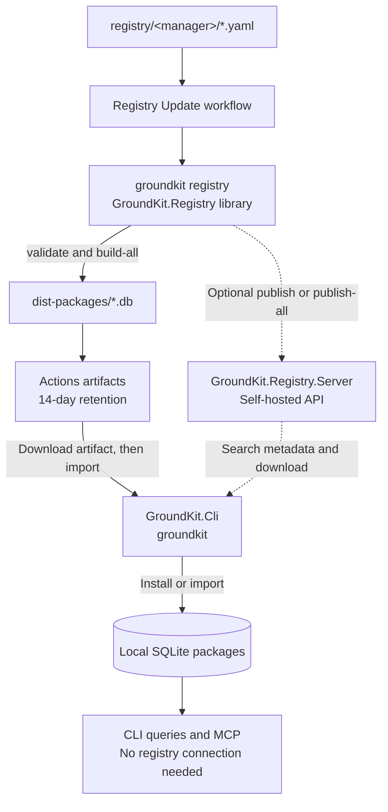
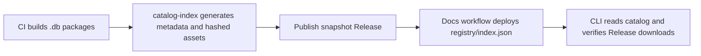

# GroundKit

Release versioning uses NBGV commit-height previews and tag-gated RC and stable releases. See the [release versioning guide](docs/guide/versioning.md) for the version contract, helper commands, and CI behavior.

GroundKit is a local-first documentation MCP for AI agents, built in .NET.

GroundKit builds documentation once, stores it as portable local packages, and serves it to AI agents through MCP without depending on a hosted documentation service.

The core model is simple:

- Ingest docs from a source such as a git repo, local folder, `llms.txt` site, or raw page.
- Normalize and chunk that content into a retrieval-friendly package.
- Store the package as a local SQLite `.db` file.
- Let MCP clients query those local packages repeatedly with low latency.

## Product direction

GroundKit is meant to cover the full local documentation workflow:

1. Detect a documentation source from a local folder, git repo, `llms.txt` site, or raw page.
2. Build a portable local package once for a specific source snapshot.
3. Store that package in SQLite with retrieval-friendly chunk metadata.
4. Expose MCP tools that let an agent resolve sources and query focused sections.
5. Keep the common path fully local after ingestion.
6. Add enough CLI and lifecycle tooling that teams can build, install, update, inspect, and share packages.

## Coverage map

### Implemented now

- .NET 10 solution split into ingestion, storage, MCP, observability, app host, and tests.
- Local directory ingestion.
- Git repository ingestion through clone-to-temp build flow.
- Automatic latest stable Git tag selection for repository sources, with explicit
  `--tag` and interactive `--choose-tag` support.
- `llms.txt` and `llms-full.txt` ingestion.
- Raw page ingestion with HTML-to-text fallback handling.
- Automatic source detection for local folder, git repo, `llms.txt`, and raw page inputs.
- Package build pipeline producing manifests, documents, chunks, fingerprints, and warnings.
- SQLite-backed package store.
- Lexical retrieval with max token budget, max hits, and relative score cutoff.
- MCP server with stdio and Streamable HTTP transports.
- MCP tools for source resolution and docs querying.
- Context7-style MCP compatibility tools: `get_docs` and `library_catalog`.
- Curated starter catalog of 20 popular JavaScript and web libraries.
- Declarative `registry/` starter definitions mirroring the curated catalog.
- Registry client with package search, versioned download, and local fallback.
- CLI commands for local package lifecycle, registry workflows, catalog discovery, and MCP serving.
- Portable package import/export using SQLite `.db` artifacts.
- Basic OpenTelemetry tracing and metrics hooks.

### Next to build

- Better docs-root discovery and stronger repository heuristics.
- Smarter markdown and HTML chunking closer to docs structure instead of simple section splitting only.
- Adjacent-chunk merge in retrieval so agents get coherent sections rather than isolated fragments.
- Package metadata inspection and health diagnostics.
- Narrow integration and unit tests around ingestion, storage, and MCP tool contracts.

### Out of scope for current phase

- Team sync service.
- Embeddings or vector search.
- Semantic or graph retrieval.
- Multi-tenant or cloud deployment concerns.

## Current architecture

Current repo shape already matches the local-first core:

- Ingestion builds packages from source material.
- Storage persists package data under `.groundkit/packages` or `GROUNDKIT_HOME/packages`.
- MCP exposes query tools over stdio.
- Observability keeps the core path measurable.

That means the project is past the idea stage. Main gap now is not core direction, but finishing the developer workflow around package lifecycle and tightening retrieval quality.

## How the MCP server works

GroundKit follows a two-phase model:

1. Build a docs package once.
2. Store it locally as SQLite.
3. Let the MCP server answer future agent queries from local data instead of a hosted docs API.

In other words, ingestion happens ahead of time and retrieval happens on demand.

### Runtime flow

When you run `groundkit mcp`, the MCP host starts a stdio MCP server by default. Pass `--http [port]` to expose the same tools through Streamable HTTP at `/mcp`. The MCP registration comes from the `GroundKit.Mcp` assembly, where tool methods are discovered and exposed through the Model Context Protocol server SDK.

At runtime the agent talks to GroundKit over stdio, not HTTP. The server does not fetch the internet during the normal query path. It assumes packages have already been built and installed locally under the package store directory.

That keeps the hot path small:

1. MCP client sends a tool call.
2. GroundKit loads package metadata or opens a local SQLite package.
3. GroundKit returns structured results and a compact readable summary.

### Tool surface

Current MCP surface is intentionally small:

- `resolve-source`: finds installed packages by package id or display name.
- `query-docs`: searches one installed package for relevant sections under a token budget.

This keeps the server focused on retrieval. Package creation, refresh, import, and export happen in the CLI workflow, while the MCP layer serves already-installed packages.

### What happens on `resolve-source`

`resolve-source` loads the installed package list from the local package store and performs simple lexical matching against package id and display name. It scores exact matches highest, then partial matches, then term overlap.

The result is returned in two forms:

- Structured JSON payload for MCP-aware clients.
- Concise plain-text summary for agents that benefit from readable tool output.

That dual-output pattern is important in this repo: tool calls return machine-readable data, but also a compact human-readable rendering generated by the local response formatter.

### What happens on `query-docs`

`query-docs` takes a package id and a topic. The package store opens the package's SQLite database and runs an FTS5 search against indexed chunk content.

Current retrieval path is:

1. Build FTS query from topic text.
2. Search the local SQLite FTS table.
3. Rank hits with BM25 weighting.
4. Drop weak results using a relative score cutoff.
5. Trim the final result set to the requested token budget.
6. Return both structured hit data and concise plain-text summaries.

This keeps the retrieval path fast and fully local. Expensive work belongs in package build time, not in every MCP call.

### Why response formatting is split from retrieval

This repo separates retrieval from presentation.

- `IPackageStore` and the SQLite store own package lookup and search.
- MCP tools own argument validation and tool contracts.
- `GroundKitToolResponseAgent` converts structured payloads into compact plain text.

That means the MCP layer can serve both structured clients and text-oriented agents without changing the retrieval engine.

### End-to-end mental model

You can think of GroundKit as two phases:

1. Offline or pre-query phase: `add` builds a package from git, local docs, `llms.txt`, or a raw page and stores it as a local SQLite `.db` file.
2. Online query phase: `groundkit mcp` exposes MCP tools that resolve packages and query those local SQLite packages with no hosted dependency.

That is the core architectural idea behind GroundKit: build once, query locally many times.

## CLI reference

Run GroundKit with `groundkit <command>`.

### Short aliases

GroundKit commands also support short names through Spectre.Console.Cli.

Run `groundkit --help`, `groundkit registry --help`, or `groundkit mcp --help`
to see the same aliases and example invocations in built-in help.

| Command            | Short alias(es) |
| ------------------ | --------------- |
| `add`              | `a`             |
| `import`           | `im`            |
| `export`           | `ex`, `exp`     |
| `list`             | `l`, `ls`       |
| `inspect`          | `ins`, `info`   |
| `query`            | `q`             |
| `refresh`          | `rf`, `ref`     |
| `remove`           | `rm`, `del`     |
| `catalog`          | `c`, `cat`      |
| `search-packages`  | `sp`, `search`  |
| `download-package` | `dp`, `dl`      |
| `install`          | `i`             |

Common options also have short forms:

| Option          | Short alias |
| --------------- | ----------- |
| `--path`        | `-p`        |
| `--name`        | `-n`        |
| `--pkg-version` | `-v`        |
| `--save`        | `-s`        |
| `--tag`         | `-t`        |
| `--choose-tag`  | `-c`        |

During development, this repository includes local `groundkit` wrappers in the
repository root. Add the repository root to `PATH` once per shell session, then
use the same `groundkit` command shown throughout this README and the docs.

### Development mode

Development mode means running the current source tree directly instead of an
installed .NET tool package. The repository root includes small launcher
scripts named `groundkit`, `groundkit.cmd`, and `groundkit.ps1` that forward to
`src/GroundKit.Cli/GroundKit.Cli.csproj` with `dotnet run`.

That gives contributors one command shape everywhere:

- `groundkit ...` during development, after adding the repo root to `PATH`
- `groundkit ...` after installing or publishing the tool

Shells pick the matching launcher automatically:

- Git Bash or other POSIX shells use `./groundkit`
- `cmd.exe` uses `groundkit.cmd`
- PowerShell can use `groundkit.cmd` from `PATH` or `./groundkit.ps1` directly

The maintainer CLI is available as the native `groundkit registry` subcommand.
`GroundKit.Registry` supplies the command library; `GroundKit.Cli` hosts its
commands in the same process during development and in the installed tool.

```bash
export PATH="$PWD:$PATH"
groundkit list
```

```powershell
$env:Path = "$PWD;$env:Path"
groundkit list
```

After publishing or installing the .NET tool, the same command name resolves to
the installed tool instead of the repository wrapper. Running GroundKit without
a command prints the command list.

Install GroundKit as a global .NET tool:

```powershell
dotnet tool install --global GroundKit
groundkit list
```

For a locally built package, install from its package directory:

```powershell
dotnet pack src/GroundKit.Cli -c Release
dotnet tool install --global --add-source ./src/GroundKit.Cli/bin/Release GroundKit
```

Update a NuGet installation with `dotnet tool update --global GroundKit`.
Update a local package installation with `dotnet tool update --global
--add-source ./src/GroundKit.Cli/bin/Release GroundKit`.

```powershell
groundkit list
groundkit inspect react
groundkit query react "useEffect cleanup"
```

### `groundkit add <source>`

Build and install a package from source. Source type is detected automatically.
Use this for libraries missing from the registry, private or internal docs, or
when you need to build from a specific source yourself.

The examples below use the installed `groundkit` executable.

**From the starter catalog:**

```bash
groundkit add react
groundkit catalog react
```

**From a git repository:**

```bash
# HTTPS URLs from GitHub, GitLab, Bitbucket, Codeberg, or another git host
groundkit add https://github.com/mattpocock/skills

# Build from a specific tag or branch
groundkit add https://github.com/mattpocock/skills/tree/v1.2.3
groundkit add https://github.com/mattpocock/skills --tag v1.2.3

# Select documentation stored below a repository root
groundkit add https://github.com/mattpocock/skills  --docs-path src/content
```

By default, `add` discovers tags and uses the latest stable SemVer tag. Use
`--tag <tag>` to pin an exact tag for automation. Use `--choose-tag` to select
from available stable tags interactively; the default picker choice is latest
stable tag. If no stable tags are available, GroundKit uses the default branch.
GitHub-style `/tree/<branch-or-tag>` URLs are also supported and select that ref
directly.

GroundKit clones git sources into a temporary directory, reads and indexes the
documentation, stores the resulting SQLite package locally, and removes the
temporary clone after the build succeeds or fails.

**From a local directory:**

Clone the sample repository, then let GroundKit discover its top-level `docs/`
folder automatically:

```bash
git clone --depth 1 https://github.com/mattpocock/skills ./skills
groundkit add ./skills
```

Use `--path` when the folder to index is not the first detected docs folder.
For example, load the repository's `skills/` folder explicitly:

```bash
groundkit add ./skills --path skills
```

`--path` is also useful when documentation lives in a custom directory. The
older `--docs-path` spelling remains supported:

```bash
groundkit add /path/to/repo --path docs
groundkit add /path/to/repo --docs-path documentation
```

Set a stable package identity and version while loading the cloned repository:

```bash
groundkit add ./skills --path docs --name mattpocock-skills --pkg-version 1.0.0
```

Save an additional copy for sharing while still installing the package locally:

```bash
groundkit add ./skills --path docs --name mattpocock-skills --pkg-version 1.0.0 \
  --save ./artifacts/mattpocock-skills@1.0.0.db
```

`--save` accepts a `.db` file path or a directory. When given a directory,
GroundKit uses the installed package filename inside that directory.

GroundKit checks `docs/`, `documentation/`, `doc/`, `website/docs/`, `guides/`,
`guide/`, `manual/`, `reference/`, `content/`, and `wiki/`, selecting the one
with the most supported documentation files. If none contains supported files,
it indexes the source root. Relative paths passed to `--path` resolve from the
local source directory.

If the source contains no supported documentation files, `add` still creates a
package but prints a warning saying that no documentation content was found.
The warning includes a Perplexity search link for finding the appropriate
documentation repository. A small package also receives a warning with the
same search suggestion because many projects keep docs in a separate repository.

**From a website, URL, or package file:**

Many documentation websites publish an [`llms.txt`](https://llmstxt.org/) file
with AI-ready documentation. GroundKit first checks a website root for
`/llms-full.txt`, then `/llms.txt`. When `llms.txt` is an index, GroundKit
follows its Markdown links and fetches the linked documents into the local
package.

Use a website root for automatic discovery, a direct `llms.txt` URL, or
`--name` to override the generated package name:

```bash
# Auto-fetch llms-full.txt or llms.txt from the website
groundkit add https://agentgateway.dev

# Add a direct llms.txt URL and follow its linked documents
groundkit add https://agentgateway.dev/llms.txt

# Use a custom package name and finding llms.txt
groundkit add https://agentgateway.dev --name agent-gateway
```

**From any URL (blog posts, articles, raw Markdown):**

```bash
# Add an article; falls back to direct HTML extraction when no llms.txt exists
groundkit add https://agentgateway.dev/blog/2026-08-20-benchmarking-agentgateway-epp-proxy-overhead/

# Add raw Markdown from a GitHub blob URL
groundkit add https://github.com/agentgateway/agentgateway/blob/main/README.md --name agentgateway-readme
```

**From a package file:**

```bash
groundkit add ./my-project --docs-path docs
groundkit add https://cdn.example.com/react@18.db
groundkit add ./react@19.1.0.db
```

**From a local saved database:**

After saving a package database, add it from the local filesystem:

```bash
groundkit add https://github.com/mattpocock/skills \
  --path docs \
  --name mattpocock-skills \
  --pkg-version 1.2.3 \
  --save ./mattpocock-skills@1.2.3.db

groundkit add ./mattpocock-skills@1.2.3.db
```

Build a package once, save the portable database, and host it from any HTTP
server. `add` downloads and installs remote `.db` URLs, including hosted
`name@version` paths:

```bash
groundkit add https://github.com/mattpocock/skills \
  --path docs \
  --name mattpocock-skills \
  --pkg-version 1.2.3 \
  --save ./artifacts/mattpocock-skills@1.2.3.db

groundkit add https://packages.example.com/mattpocock-skills@1.2.3
```

`add` supports `--path <path>` and its `--docs-path <path>` alias for repository
or directory sources. It builds locally and stores the resulting SQLite
package; it does not query or download from the registry. `--name <name>`
overrides the package ID and display name, while `--pkg-version <version>`
stores an explicit package and source version.

To import an existing local or remote `.db` package, use `install`:

```bash
groundkit install ./react@19.1.0.db
groundkit install https://example.com/react@19.1.0.db
```

For a website root, `add` first probes `/llms-full.txt` and `/llms.txt`. If
neither endpoint exists, GroundKit fetches the requested page directly. HTML
pages are reduced to readable article content before indexing; raw Markdown and
other text responses are indexed as-is. Direct article and raw Markdown URLs
also work:

```bash
groundkit add https://overreacted.io/things-i-dont-know-as-of-2018/
groundkit add https://raw.githubusercontent.com/neuledge/context/main/README.md
```

If a source produces fewer than three indexed sections, GroundKit prints a
low-section warning suggesting that documentation may be in another repository
or subfolder. It does not currently generate a Google search link.

### `groundkit install <registry/name|name|source> [version]`

Install with local-first resolution. This is the fallback-capable workflow:

```bash
# Search registry only when no matching local package exists
groundkit install npm/react

# Request exact version
groundkit install npm/react 19.1.0

# Bare names default to npm
groundkit install react

# Missing registry package falls back to local catalog/source build
groundkit install react 19.1.0
```

Resolution order:

1. Reuse matching package already in local store. No network request.
2. Search configured registry and import matching `.db` artifact.
3. If registry has no match or is unavailable, build from the catalog or source locally.

### `groundkit search-packages <registry> <name> [version]`

Search registry metadata and versions. Search is read-only: it never downloads
or installs a package.

```bash
groundkit search-packages npm react
groundkit search-packages npm react 19.1.0
groundkit search-packages pip django
```

### `groundkit download-package <registry> <name> <version>`

Download one exact pre-built registry package. This is strict and does not
fallback to another version or local build when the artifact is unavailable.

```bash
groundkit download-package npm react 19.1.0
```

Use `install` instead when registry failure should trigger local fallback.

### `groundkit import <package-file>` and `groundkit export <package-id> <destination>`

Import or share portable SQLite package artifacts without rebuilding:

```bash
groundkit import ./artifacts/react@19.1.0.db
groundkit export react ./artifacts
```

### `groundkit list`, `inspect`, `query`, `refresh`, and `remove`

- `groundkit list` displays installed package ids, versions, document counts, section counts, and totals.
- `groundkit inspect <package-id>` displays package metadata, source information, and local database path.
- `groundkit query <library> <topic>` searches one installed package locally and returns the same JSON shape as MCP `get_docs`.
- Use `library@version` for an exact installed version; a bare library name selects the newest installed version.
- `groundkit refresh <package-id>` rebuilds a package from its recorded source.
- `groundkit remove <name[@version]>` removes one installed package version. A
  bare name is accepted when only one version is installed. If multiple
  versions exist, GroundKit lists them and asks you to choose one interactively;
  non-interactive runs fail without deleting anything.

Examples:

```bash
groundkit list
groundkit inspect react
groundkit query react "useEffect cleanup"
groundkit query 'nextjs@16.0' 'middleware authentication'
groundkit remove mattpocock-skills
groundkit remove mattpocock-skills@1.2.3
groundkit remove agentgateway
groundkit export react ./artifacts
```

### Start MCP servers

- `groundkit mcp` starts the MCP server over stdio. It reads only packages already in the local store.
- `groundkit mcp --libs package-a,package-b` or `groundkit mcp -l package-a,package-b` restricts the session to selected installed package names.
- `groundkit mcp --http [port] --host <host>` starts the Streamable HTTP MCP host and exposes MCP at `/mcp`.
- `groundkit mcp http --urls http://localhost:4000` or `groundkit mcp h -u http://localhost:4000` provides the explicit URL form.
- `docker compose up --build mcp` starts the HTTP server at `http://localhost:8081/mcp`.
- `docker compose run --rm -i mcp-stdio` runs the Docker MCP server over stdio for clients that launch containers as subprocesses.

During development, run the native `groundkit mcp` subcommand; no separate
script `PATH` entry is required.

Short aliases for the MCP executable:

| Command  | Short alias |
| -------- | ----------- |
| `http`   | `h`         |
| `--libs` | `-l`        |
| `--urls` | `-u`        |

Examples:

```bash
groundkit mcp
groundkit mcp -l react,vite
groundkit mcp --http 4000 --host 0.0.0.0
```

### `groundkit catalog [query]`

List the initial curated sources:

```bash
groundkit catalog
groundkit catalog react
```

Catalog names can be passed directly to `add`. GroundKit expands them to their
known repository and documentation path before building a local package:

```bash
groundkit add react
```

The MCP server exposes `library_catalog` for discovery and `get_docs` as the
Context7-compatible name for the existing local retrieval tool. `resolve-source`
and `query-docs` remain available for existing clients.

## Registry packages, bundles, and OCI distribution

GroundKit can use any compatible GroundKit registry. Consumer commands default to
the public catalog at
`https://mehdihadeli.github.io/groundkit/registry/index.json`. Set
`RegistryUrl` or `GROUNDKIT_REGISTRY_URL` for a different catalog or API.
Registry access is explicit and user-controlled:
GroundKit never downloads packages in the background, during `serve`, or merely
because a package name appears in configuration. A package is downloaded only
after the user runs `download-package` or `install`.

There are three end-user registry workflows:

1. **Search, then choose.** Run `search-packages` to inspect available versions.
   This is discovery only and never changes the local store. Then run
   `download-package` for the exact version you approve.
2. **Explicit registry download.** Run `download-package <registry> <name> <version>`
   when you already know the exact artifact to install. This is the
   strict path for reproducible installs.
3. **Local-first install.** Run `install <registry/name> [version]` or
   `install <name> [version]`. GroundKit first checks the local store, then
   searches the registry and installs a matching artifact, then builds from the
   catalog or supplied source locally if registry lookup has no match or the
   registry cannot be reached.

Examples for each workflow:

```bash
# 1. Search, review versions, then choose one
groundkit search-packages npm next
groundkit download-package npm next 15.5.0

# 2. Install one exact artifact without discovery
groundkit download-package npm react 19.1.0

# 3. Let local-first install resolve registry or local fallback
groundkit install npm/vite
groundkit install react 19.1.0
```

For `install`, resolution order is:

1. Matching package already exists in the local store. No network request is made.
2. Registry search finds a matching package. GroundKit downloads the `.db` artifact and imports it locally.
3. Registry has no match or cannot be reached. GroundKit builds from the built-in catalog or the supplied local/source input and saves that package locally.

`download-package` is intentionally strict: it installs the requested registry
artifact and reports an error if that exact registry download fails. Use
`install` when local fallback is required. After any successful registry import,
MCP queries use the local SQLite package and do not contact the registry.

### Configure registry address

Set registry address per project in `.groundkit/config.json`:

```json
{
  "RegistryUrl": "http://localhost:8080"
}
```

Or override it for one shell/session with `GROUNDKIT_REGISTRY_URL`:

```powershell
$env:GROUNDKIT_REGISTRY_URL = "https://registry.example.com"
groundkit search-packages npm react
```

Environment variables take precedence over `.groundkit/config.json`. Copy
`.groundkit/config.example.json` to `.groundkit/config.json` for a complete
example. `HttpHeaders` can provide registry authentication or other request
headers; do not commit credentials to project configuration.

### Registry distribution flow

`GroundKit.Registry` builds packages through the `groundkit registry` branch.
`GroundKit.Registry.Server` is an optional, separately deployed API. The
[Registry Update workflow](.github/workflows/registry-update.yml) currently
creates package files and uploads Actions artifacts; it does not start or
publish to a registry server.



Solid arrows show the current artifact workflow. Dashed arrows show supported
API publishing, which is not enabled in the current workflow. The API stores
metadata in SQLite and package files in S3-compatible storage; it does not build
documentation. Consumers install packages explicitly and then query them locally.

| Distribution target | Commands used by maintainers or CI | Availability |
| --- | --- | --- |
| Actions artifacts | `registry validate`, `registry build-all` | Current workflow; temporary file downloads, not a searchable API. |
| Offline bundles | `registry build-all`, `registry bundle`, `registry import-bundle` | Available locally; not included in the current workflow. |
| Self-hosted API | `registry validate`, `registry publish` or `registry publish-all` | Supported commands and server; CI publishing is optional and not configured. |
| Releases + Pages | `registry validate`, `registry build-all`, `registry catalog-index`, then GitHub upload and deployment steps | Implemented; requires successful CI and Pages configuration. |

For API publishing, CI can replace `build-all` with `publish-all`, which builds
and uploads missing versions. Configure a runner-reachable `REGISTRY_SERVER_URL`
and a secret `REGISTRY_PUBLISH_KEY`. Do not publish from untrusted contributor PRs.
For Releases + Pages, retain `build-all`; API `publish-all` is not a GitHub
Release uploader. See the [maintainer flow guide](src/GroundKit.Registry/README.md#distribution-flow)
for the commands and an optional API publishing step.

### Registry API option

The HTTP registry is the native distribution option for GroundKit clients. A
registry server provides searchable metadata and immutable SQLite artifacts:

```http
GET /search?registry=npm&name=react&version=19.1.0
GET /packages/npm/react/19.1.0
GET /packages/npm/react/19.1.0/download
```

Run the included local registry with Docker Compose:

```bash
cp .env.example .env
# Set REGISTRY_PUBLISH_KEY in .env
docker compose up --build registry-api
```

The API host is the separate `GroundKit.Registry.Server` project. Maintainer
commands in `GroundKit.Registry` build and publish packages but do not host the
API. For direct hosting, use
`dotnet run --project src/GroundKit.Registry.Server -- --urls http://localhost:8080`;
start the host directly, not through a registry maintainer command. See the
[server README](src/GroundKit.Registry.Server/README.md) for configuration.

The registry API listens on `http://localhost:8080`. Point GroundKit at another
server with `.groundkit/config.json`:

```json
{
  "RegistryUrl": "https://registry.example.com",
  "HttpHeaders": {
    "Authorization": "Bearer replace-me"
  }
}
```

Without configuration, consumer commands use the public Pages catalog at
`https://mehdihadeli.github.io/groundkit/registry/index.json`. Set
`GROUNDKIT_REGISTRY_URL` or `RegistryUrl` to use another catalog or API. Use
`HttpHeaders` for private registry request headers, but keep secrets out of
committed files. MinIO backs the included registry storage at
`http://localhost:9001`; clients use the API address, not the MinIO address.

### Bundle option for offline or bulk transfer

The registry maintainer CLI builds packages and creates a bundle containing all
`.db` files, `index.json`, and `SHA256SUMS`:

```bash
groundkit registry validate --dir registry
groundkit registry build-all --dir registry --output ./dist-packages
groundkit registry bundle --output ./dist-packages --format zip
groundkit registry bundle --output ./dist-packages --format tar.gz
```

Import a bundle on an offline machine, then query or serve the imported packages:

```bash
groundkit registry import-bundle \
   ./dist-packages/groundkit-registry.zip --output ./imported-packages
groundkit import ./imported-packages/react@latest.db
groundkit list
```

The bundle is a distribution artifact, not a live registry. Importing its `.db`
files enables local queries, not `search-packages`. Registry search requires
a compatible API or a configured static catalog.

### GitHub Actions artifact option

The included `Registry Update` workflow runs on schedule and manual dispatch.
It validates definitions, builds individual `.db` files, and uploads them as a
GitHub Actions artifact named `groundkit-registry-<run-id>`. Bundles can be built
locally with the commands above; the workflow does not create them yet.

Download that artifact from GitHub Actions or with GitHub CLI:

```bash
gh run list --workflow registry-update.yml
gh run download <run-id> --name groundkit-registry-<run-id> --dir ./registry-download
groundkit import ./registry-download/react@latest.db
```

GitHub Actions artifacts are suitable for CI handoff and short-lived builds.
The workflow currently retains them for 14 days, so use a release asset, bundle
archive, or HTTP registry for durable distribution.

### GitHub Releases + Pages

The [Registry Update workflow](.github/workflows/registry-update.yml) builds
packages and generates a catalog, then publishes a snapshot Release on `main`.
The [docs workflow](.github/workflows/deploy-docs.yml) deploys that catalog
alongside the existing Pages site after a successful registry run. Source support
is implemented; a public endpoint exists only after both workflows succeed.



| Component | Implementation |
| --- | --- |
| Catalog generation | `groundkit registry catalog-index` reads SQLite identity/version, matches definitions, and creates URLs, sizes, and SHA-256 entries. |
| Release assets | Registry Update publishes `registry-<run-id>-<attempt>` snapshots, without overwriting earlier assets or marking snapshots as the latest CLI release. |
| Pages catalog | Docs deployment preserves the newest published catalog at `registry/index.json`. |
| Consumer verification | Existing `search-packages`, `download-package`, and `install` commands use static mode for a full `index.json` URL and verify downloads before import. |

Enable Pages with the GitHub Actions source and allow workflow Release writes.
Enable release immutability for platform-enforced protection. Workflows must be
on the default branch and all build/test gates must pass. The Pages deployment
summary reports the actual catalog URL. Configure it explicitly:

```powershell
$env:GROUNDKIT_REGISTRY_URL = "https://OWNER.github.io/REPOSITORY/registry/index.json"
groundkit search-packages npm react
groundkit install npm/react
```

Replace the example URL with your deployment. No self-hosted server or new
consumer commands are needed. A site root is not a catalog URL: include the full
`registry/index.json` path. API base URLs continue to use the self-hosted protocol.
Direct Release `.db` URLs also work, but bypass catalog checksum verification.
See the [registry tooling README](src/GroundKit.Registry/README.md#public-distribution-status)
for catalog generation and publication details.

### OCI option through GHCR

OCI packages are an optional external distribution channel when teams already
authenticate to GHCR. The current workflow does not push OCI artifacts, and
GroundKit's registry client does not pull them directly. If maintainers publish
packages with ORAS, users can pull the artifact and import its `.db` file:

```bash
oras login ghcr.io -u USERNAME --password-stdin
oras pull ghcr.io/OWNER/groundkit-packages:react--19.1.0-<commit12>
groundkit import ./react--19.1.0-<commit12>.db
```

The commands above illustrate a possible tag and filename convention, not an
existing published artifact. Use the actual reference supplied by the maintainer.
Suggested OCI artifact media types are:

```text
application/vnd.groundkit.package.v1+sqlite
application/vnd.groundkit.package.v1
```

Use the HTTP registry API or a static catalog for named-package search and
installation. Bundles, GitHub artifacts, and OCI provide external file-transfer
options.

### Registry maintainer commands

`GroundKit.Registry` is a command library used by `GroundKit.Cli`, not a separate
executable or tool installation. Maintainer commands live under `groundkit registry`:

Short aliases for the maintainer CLI:

| Command | Short alias(es) | Used for |
| --- | --- | --- |
| `list` | `l`, `ls` | Contributor and maintainer definition discovery. |
| `validate` | `v`, `val` | Local checks and the current CI workflow. |
| `build` | `b` | Building one definition locally. |
| `build-all` | `ba` | Bulk builds and the current CI workflow. |
| `publish` | `p`, `pub` | Uploading one package to an optional self-hosted API. |
| `publish-all` | `pa` | Bulk API publishing by maintainers or configured CI. |
| `bundle` | `bd`, `bun` | Offline or bulk artifact distribution. |
| `import-bundle` | `ib` | Extracting bundles before importing individual packages. |
| `catalog-index` | None | Generating catalog metadata and content-addressed Release asset copies. |

| Option          | Short alias |
| --------------- | ----------- |
| `--dir`         | `-d`        |
| `--output`      | `-o`        |
| `--format`      | `-f`        |
| `--destination` | `-t`        |
| `--base-url`    | None        |

```bash
groundkit registry list --dir registry
groundkit registry validate --dir registry
groundkit registry build react --dir registry --output ./dist-packages
groundkit registry publish react --dir registry --output ./dist-packages
groundkit registry publish-all --dir registry --output ./dist-packages
```

Short-form example:

```bash
groundkit registry b react -d registry -o ./dist-packages
```

Set `REGISTRY_SERVER_URL` and `REGISTRY_PUBLISH_KEY` when publishing to an
HTTP registry. Publishing is for maintainers or CI; end users only need the
registry URL and read access.

### Opt-in package policy

Default policy is manual approval. Keep `.groundkit/config.json` focused on
connection and limits; it is not a package download list. Review packages with
`search-packages`, then explicitly run `download-package` or `install`. Start
the MCP server only after approved packages appear in `list`.

MCP agents can use `search_packages`, `download_package`, and `get_docs`, but
tool availability does not trigger downloads automatically. Downloaded `.db`
packages are imported into the local store and queried without a network call.

## Near-term roadmap

1. Tighten package lifecycle UX and semantics: naming, versioning, inspection, and refresh behavior.
2. Tighten build fidelity: docs path discovery, source versioning, better chunking, dedupe, and warnings.
3. Tighten retrieval quality: title weighting, adjacent merge, better formatting for agent consumption.
4. Expand tests around end-to-end local package build, export/import, and query behavior.
5. Consider optional later-phase features only after the local lexical path feels solid.

## Success criteria

GroundKit is successful when a developer can:

1. Point the tool at a repo, local docs folder, `llms.txt` site, or raw page.
2. Build a local package once.
3. Run the MCP server locally.
4. Let an agent resolve installed sources and query docs with no hosted dependency.
5. Share the resulting package artifact with another machine without rebuilding from scratch.
