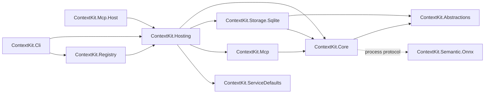
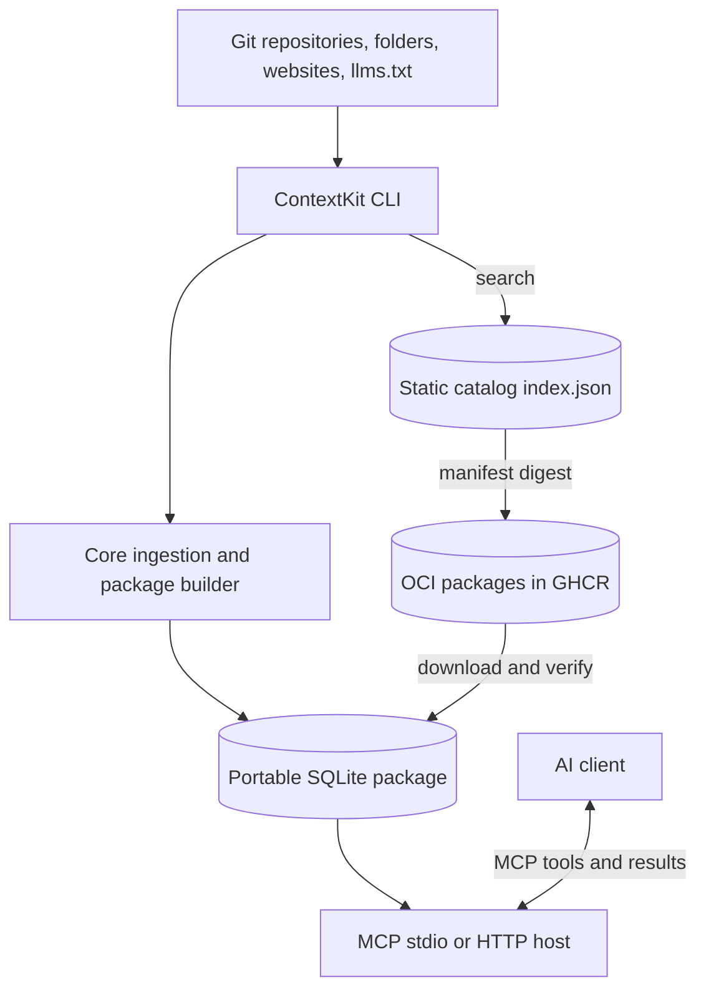
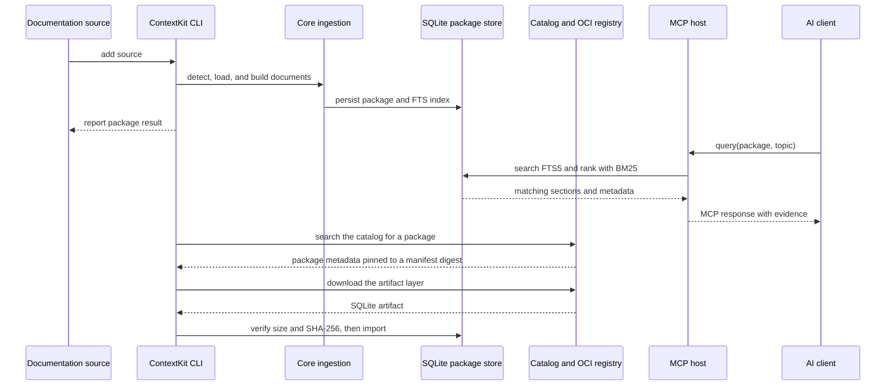
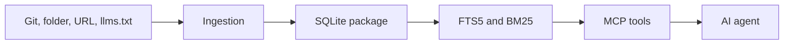

# Architecture

ContextKit separates expensive ingestion from the fast retrieval path.

## Project boundaries

The solution is organized around dependency direction rather than one project per
technical noun:

```text
src/
├── ContextKit.Abstractions/       # Shared records, options, and service interfaces
├── ContextKit.Core/               # Ingestion, OCI, telemetry, semantic runtime
├── ContextKit.Storage.Sqlite/     # SQLite, lexical retrieval, vector sidecars
├── ContextKit.Hosting/            # DI composition and shared MCP startup
├── ContextKit.Cli/                # User-facing command-line tool
├── ContextKit.Mcp/                # Reusable MCP tools, formatting, transports
├── ContextKit.Mcp.Host/           # Standalone groundkit-mcp executable
├── ContextKit.Registry/           # Registry maintenance and package tooling
├── ContextKit.Semantic.Onnx/      # Optional, separately distributed worker
└── ContextKit.ServiceDefaults/    # Host telemetry, health checks, and resilience
```

The dependency direction is:



`ContextKit.Abstractions` has no SQLite, EF Core, MCP, or CLI dependency. SQLite
entities remain internal to `ContextKit.Storage.Sqlite`; they are not a public
schema package. MCP payloads remain MCP adapter contracts rather than leaking
into the core domain.

`ContextKit.Mcp` is a library, not an executable. The CLI and standalone
`ContextKit.Mcp.Host` each own their command-line adapters and call shared startup
in `ContextKit.Hosting`. Releases publish the `ContextKit` and `ContextKit.Mcp`
tool packages; the adapter's `ContextKit.Mcp.Adapter` identity is not published.

Semantic records and the embedding/configuration interfaces live in
`ContextKit.Abstractions`. Hosting registers the concrete `SemanticRuntime`;
SQLite reads configuration and embeddings through interfaces. Its remaining
Core reference supplies shared telemetry, not provider installation or startup.
Core and SQLite use focused Microsoft.Extensions packages rather than requiring
the ASP.NET shared framework. HTTP hosting projects retain that framework.

The ONNX worker has no project-reference path from either tool. Provider ZIPs
and model files are downloaded only by explicit semantic setup commands.

## High-level architecture

ContextKit has two main paths: an ingestion path that creates portable SQLite
packages, and a retrieval path that serves those packages to an AI client.



## Component interactions

The common workflows connect the adapters to the same core and storage
services. HTTP hosts also expose health endpoints and use `ServiceDefaults`;
stdio and CLI processes remain local console applications.



## Host defaults and logging

`ContextKit.Hosting` provides shared dependency-injection composition through
`AddGroundKitServices()`. That registration method does not configure logging
or OpenTelemetry. `GroundKitMcpHosting` also provides shared stdio and HTTP
startup, including the transport-specific logging and health configuration.

`ContextKit.ServiceDefaults` is used for MCP HTTP startup, whether invoked through
`ck mcp --http` or `groundkit-mcp --http`. An HTTP host has a service lifecycle, so it benefits from the
default health checks, HTTP resilience, service discovery, and OpenTelemetry
configuration provided by `AddServiceDefaults()`. The stdio MCP host and the CLI
stay plain console processes.

The CLI uses the console logger directly. Errors are emitted at the default
level, while `ck --verbose <command>` enables informational logs. Logs
go to standard error so command results, including query JSON, remain clean on
standard output. OpenTelemetry is intentionally opt-in for the CLI because a
one-shot local process normally has no collector or service-level telemetry
destination.

Tests follow the same ownership boundaries: `ContextKit.Core.Tests`,
`ContextKit.Storage.Sqlite.Tests`, `ContextKit.Cli.Tests`,
`ContextKit.Mcp.Tests`, and `ContextKit.Registry.Tests`.

Additional protocol, client, and SDK packages are intentionally deferred. They
should be introduced only when an API has independent consumers, release
versioning, or a deployment lifecycle separate from the current host.



## Build phase

The ingestion layer detects the source, loads supported documents, extracts sections, estimates tokens, computes fingerprints, and creates a `BuildResult`.

The storage layer persists manifests, source metadata, documents, chunks, warnings, and an FTS5 search table in one portable `.db` file.

## Query phase

The MCP server opens the selected package, applies the selected search mode,
and trims results to the requested token budget. Lexical search uses FTS5/BM25.
Optional semantic search uses locally generated vectors in model-specific
sidecars; hybrid search combines both rankings with reciprocal rank fusion.
See [search modes](./grounding#choosing-a-search-mode) for setup and tradeoffs.

Queries do not fetch the internet. Registry access is only needed when discovering or downloading a package.

The result includes package identity and version, selected document and section titles, content, token estimates, code presence, and relevance scores. This makes retrieved evidence inspectable by both an MCP client and a human reviewing an agent response.

MCP responses include structured payloads and deterministic text formatting.
Formatting does not call an LLM or depend on Microsoft Agent Framework.

## Data boundaries

ContextKit is a static documentation grounding layer. It is appropriate for versioned API references, guides, runbooks, and other documents that can be packaged. It is not a source of live operational truth: prices, inventory, feature flags, and service status belong behind a current API or database query.

## Why SQLite

Library documentation is curated, structured, and queried with concrete API
names. Full-text search gives inspectable exact-term matching without embedding
generation or a remote query dependency. Semantic sidecars support questions
with weak vocabulary overlap without changing the portable package format.
They are optional; lexical search remains the default.
