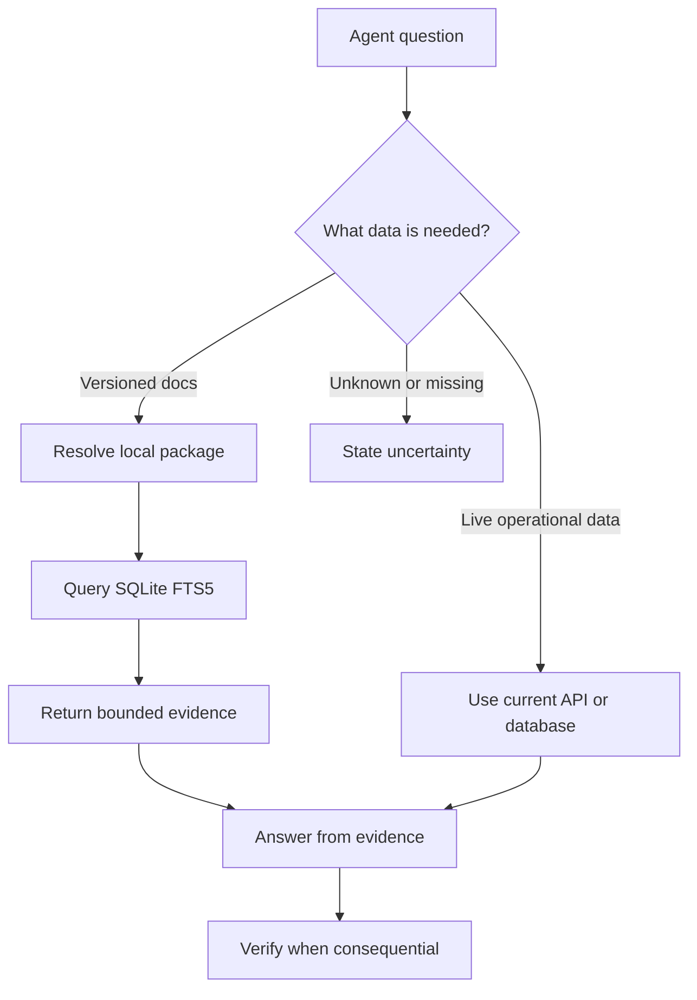

# Grounding model

Grounding connects an agent to external facts at response time. ContextKit grounds agents in versioned technical documentation stored in local SQLite packages.

Retrieval is evidence, not an instruction to fabricate an answer. The host agent must use returned sections, preserve uncertainty, and verify consequential decisions against the source.

## Grounding pipeline

1. Classify the request. Documentation questions need a package; live prices, status, and inventory need a current API or database; broad general knowledge may not need retrieval.
2. Identify the library and exact version needed from the project or user request.
3. Resolve an installed package with `resolve-source` or `library_catalog`.
4. If it is missing, use `search_packages`, select an exact version, and install it with `download_package`.
5. Retrieve focused sections with `query-docs` or its `get_docs` compatibility alias.
6. Use the structured hits and readable text as evidence for the response.
7. When the decision matters, compare the answer with the returned source metadata and relevant sections before acting.

When the library is not obvious from the request, `find_libraries` resolves it from the question alone, and `search-docs` collapses steps 3 to 5 into one call that may search several packages at once. See [Question-based search](/guide/question-search).



## Why full-text search is the default

Documentation is usually curated, structured, and full of exact identifiers such as method names, options, and error codes. SQLite FTS5 with BM25 keeps those terms inspectable and avoids embedding generation, vector infrastructure, and a remote query dependency.

Vector search is still useful for large, heterogeneous, or poorly structured corpora, semantic-gap queries, and multimodal search. Choose it when those retrieval problems exist, not as a requirement for documentation grounding.

## Precision rules

- Prefer the package whose version matches the project dependency.
- Query with short API names, symbols, error codes, and concrete keywords.
- Keep `maxTokens` and `maxHits` bounded so evidence stays focused.
- Use `relativeScoreCutoff` to reject weakly related sections.
- Treat empty or weak results as missing evidence. Resolve the package, version, or query before answering from memory.
- Use package inspection when source location, fingerprint, build time, or freshness matters.
- Keep live and static facts separate. A locally indexed page cannot prove a current price or service status.

### Query matching and budgets

Unquoted words are literal alternatives joined with OR, which supports natural-language questions
without requiring every question word to appear. Paired double quotes preserve an exact phrase:
`"request interceptors"` does not match a section containing only `request` or separated occurrences
of the two words. Punctuation separates words, underscores preserve identifier phrases, and FTS
operators such as `OR` are searched as text rather than executed. Unmatched quotes are ignored.
Unicode terms are supported, but the default tokenizer does not segment Chinese text into words.

BM25 weights remain 5 for document titles, 10 for section titles, and 1 for content. Search retrieves
at least 20 candidates before applying the relative cutoff, returned-hit limit, and token budget.
Equal scores use source path and section sequence for deterministic ordering. Returned hits include
their source path for citations.

The best hit is returned whole even when it exceeds a positive token budget. Later sections that
do not fit are skipped so smaller relevant sections can still be returned. Single-package queries
and multi-package rank fusion follow this rule; `totalTokens` can exceed `maxTokens` for that first
oversized section. Content is never truncated mid-example.

## Choosing a search mode

| Mode | How sections are ranked | Useful query | Requirements |
| --- | --- | --- | --- |
| `lexical` | SQLite FTS5/BM25 | `useEffect cleanup`, an error code, or an exact phrase | An installed documentation package |
| `semantic` | Normalized local embedding similarity | `stop background work after component removal` | Optional ONNX provider and model |
| `hybrid` | Reciprocal-rank fusion of lexical and semantic rankings | An API name combined with a description of the behavior | Optional ONNX provider and model |

Start with lexical search for exact identifiers. Try semantic when the question and
documentation use different wording, or hybrid when both wording and identifiers
matter. Compare returned sections on your own queries; optional modes are not a
guarantee of better answers. Quoted phrase matching is a lexical rule, not a constraint
on semantic results. A hybrid query can return an embedding match outside the phrase.

Library detection still matches names and aliases, regardless of search mode. A semantic
question without a library name needs a package id or `--libraries` hint. See
[Question-based search](/guide/question-search).

Use `--include-adjacent` to add bounded neighboring sections, or
`--include-references` to follow one verified relative Markdown link from each primary hit.
Both options are off by default and remain subject to the hit and token limits.

### Use lexical search without extra downloads

```bash
dotnet tool install --global ContextKit
ck add react
ck query react "useEffect cleanup" --search-mode lexical
```

The main tool has no ONNX Runtime, Semantic Kernel, tokenizer, or model dependency.
Lexical is the default until you explicitly enable another mode. An explicit lexical
override also works when semantic assets are missing or the configured default is hybrid.

### Install optional assets

1. Install the ONNX provider for your OS and architecture:

	```bash
	ck semantic provider install onnx
	```

	The installer downloads a separate provider ZIP and manifest from the ContextKit
	GitHub release matching your tool version. Supported targets are Windows x64,
	Linux x64, macOS x64, and macOS arm64. The worker reuses .NET 10; it does not need
	Docker, Ollama, or an API key.

2. Install the pinned model:

	```bash
	ck semantic model list
	ck semantic model install bge-micro-v2
	```

	BGE Micro V2 supports English, returns 384 dimensions, and has an MIT license.
	Quantized model, vocabulary, and license downloads total about 17.6 MB.

3. Try both optional modes without changing the default:

	```bash
	ck query react "stop background work after component removal" --search-mode semantic
	ck query react "stop background work after component removal" --search-mode hybrid
	ck semantic status
	```

Installing provider/model assets alone leaves the configured mode unchanged. The
first optional query builds a missing index locally. Subsequent queries reuse it.
Query text stays on your machine; queries do not install providers or models.
Package auto-download is separate: use CLI `--no-install` to disallow it.

### Set a default or override one query

```bash
ck semantic enable --model bge-micro-v2 --mode hybrid
ck query react "stop background work after component removal"
ck query react "useEffect" --search-mode lexical
ck semantic enable --model bge-micro-v2 --mode semantic
ck semantic disable
```

`enable` tests embedding generation and indexes installed packages before saving
the new default. It accepts `semantic` or `hybrid`; the omitted `--mode` defaults
to hybrid. `disable` restores lexical and retains provider, model, and indexes.
An explicit CLI `--search-mode` or MCP `searchMode` wins over the saved mode.
CLI and MCP use the same settings when they use the same `GROUNDKIT_HOME`.

MCP tools `query-docs`, `get_docs`, `ask-docs`, and `search-docs` accept `searchMode`.
See [MCP search mode examples](/reference/mcp-tools#search-modes).

### Prepare indexes and manage assets

```bash
ck semantic index react
ck semantic index
ck semantic model use bge-micro-v2
ck semantic status
```

`index react` prepares one installed package; omit the package id to prepare all.
`model use` selects a verified installed model. Settings, provider, model, and vector
indexes live under `GROUNDKIT_HOME/semantic`, or `~/.groundkit/semantic` when unset.
Portable documentation `.db` packages do not gain vectors or model files.

### Troubleshooting

| Symptom | What to check |
| --- | --- |
| Provider or model missing | Run the explicit install commands above, or use `--search-mode lexical`. |
| Provider release asset unavailable | Confirm that the matching ContextKit release includes provider assets for your target. For source/offline setup, import a trusted local bundle using the [CLI reference](/reference/cli#optional-semantic-setup). |
| First semantic query is slow | It may be building a missing index. Prepare it with `ck semantic index react`. |
| CLI and MCP appear to use different modes | Check `ck semantic status` and ensure both processes use the same `GROUNDKIT_HOME`; check for per-query overrides. |
| Weak paraphrase or non-English results | The initial model profile is English. Compare lexical/hybrid results and make the package, version, and topic more specific. |

Missing setup fails with an actionable error. ContextKit does not silently switch
to another mode. A linear vector scan makes semantic lookup more expensive as
the corpus grows; the current implementation is intended for modest documentation packages.

## Local embedding behavior

Hybrid combines independent rankings using reciprocal-rank fusion with constant 60
and deduplication by chunk id. The cutoff and token budget apply after fusion,
not to an average of incompatible BM25/cosine scores.

The optional worker uses Semantic Kernel's ONNX connector through `IEmbeddingGenerator`,
without kernel orchestration. The main NuGet tool has no ONNX dependency. The pinned quantized
BGE Micro V2 profile includes WordPiece vocabulary, mean pooling, normalization, and a 512-token
model limit. Section titles accompany overlapping content windows; the best window score
represents a section, and the original section is returned whole. Window boundaries are
character-based; unusually token-dense text may still be truncated by the model. The initial
profile supports English, not a multilingual guarantee.

Embeddings are cached in separate SQLite sidecars keyed by package SHA-256 and model/profile
identity. Package or model changes generate a new cache. The first semantic query builds missing
vectors locally; later queries embed only the question. Search scans cached vectors rather than
using an approximate-nearest-neighbor index, so cost grows with corpus size.
`ck semantic index [package-id]` prepares indexes explicitly. Existing `.db` artifacts and
registry checksums remain unchanged. Old sidecars are retained, not deleted automatically.

## Further retrieval extensions

ContextKit supports lexical, optional local semantic, and hybrid retrieval. The storage tests keep
these modes comparable on the same fixture so changes can be evaluated for exact terms, paraphrases,
and consensus hits. Hybrid uses rank fusion rather than comparing BM25 and cosine scores directly.

Chunk adjacency and verified local references are available as opt-in retrieval context. Adjacent
expansion follows persisted previous/next chunk ids and is bounded to three sections in either
direction. Reference expansion follows one relative Markdown link per primary hit only when its
target path exists in the same package. External URLs, missing targets, and inferred relationships
are ignored. Both expansions remain subject to hit and token limits.

This is graph-assisted retrieval, not a complete GraphRAG pipeline. ContextKit does not infer
`extends`, `example_of`, or other semantic relations from word similarity, and it does not let
expanded context outrank the primary match. A future persisted relations table would need a
precision benchmark before replacing this bounded link-based behavior.

Before enabling optional retrieval by default, compare precision at the returned-hit limit, reciprocal
rank of the first relevant answer, recall, latency, and package size on labeled queries covering API
names, paraphrases, quoted phrases, and unrelated topics. Documentation quality signals should report
observed guide, reference, example, and README coverage separately; a percentage requires an explicit
coverage rubric and must not be presented as proof of completeness or used to suppress exact matches.

## Reading query results

Each result identifies the package and version, then returns document and section titles, content, token estimates, code presence, and a relevance score. Structured MCP content is available to clients that support it; concise text is available to clients that consume tool output as prose.

The score ranks results inside the query. It is not a truth probability. A high score does not replace checking the version, source, or surrounding section.

## What ContextKit does not do

ContextKit does not browse the internet during local queries, guarantee that a source is current, or verify every generated answer. Registry access is used for discovery and package download. The host agent remains responsible for selecting evidence, explaining conflicts, and citing or linking sources when the workflow requires it.
