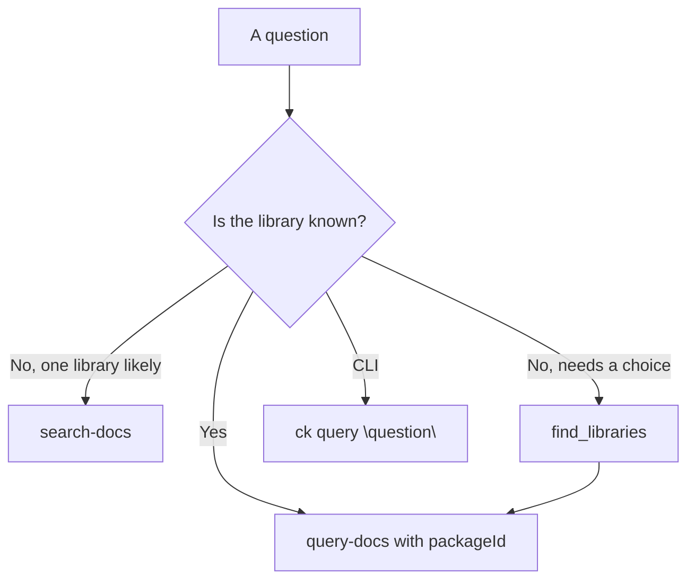

# Question-based search

A documentation question usually names the topic but not the package. "How do I add
a request interceptor in axios?" mentions axios; "how do I stream an OpenAI response
from a Next.js route?" spans two libraries. ContextKit answers both without the caller
having to resolve a package first.

The work splits into two stages, and every entry point exposes both:

1. **Find the library.** Match the question against the libraries you know about —
   installed packages first, then the curated catalog.
2. **Query the docs.** Retrieve sections using lexical search (default), optional semantic
  similarity, or hybrid search.

Doing the library lookup first is what makes the second stage fast and precise: the
search only has to compete over one package's sections instead of a global index.

## Stage 1: find the library

`find_libraries` resolves a question to one or more library ids. It never touches the
network and never installs anything; it ranks what is already known.

```jsonc
// find_libraries
{
  "question": "how do i use hooks?",
  "libraryName": "react",   // optional: narrow the candidate names
  "maxResults": 5
}
```

Each result carries an `libraryId` that `query-docs` accepts directly, plus whether the
package is installed and, for a curated but uninstalled library, the repository and docs
path needed to build it.

Use it when the library is unclear, or when you want to show a choice before answering.
When you already know the package, skip straight to stage 2.

## Stage 2: query the docs

Two tools answer from one or more packages:

| Tool        | Input                      | Installs?                            |
| ----------- | -------------------------- | ------------------------------------ |
| `query-docs`| one `packageId` + `topic`  | no                                   |
| `search-docs`| `question` + optional hints | yes, the libraries the question names |

`search-docs` is the one-call path. It resolves the libraries from the question, uses an
installed copy when there is one, downloads a published one when there is not, queries
each, and returns a single merged ranking:

```jsonc
// search-docs
{
  "question": "how do i add an interceptor in axios?",
  "libraries": ["axios"],  // optional hints, up to four
  "maxTokens": 2000,
  "maxHits": 8,
  "relativeScoreCutoff": 0.5
}
```

Every hit is tagged with the `packageId` it came from, so an answer that spans libraries
is still attributable.

## Select a retrieval mode

Library detection and section retrieval are separate. `find_libraries` always matches
library names and aliases; it does not use embeddings. After selecting packages,
CLI `--search-mode` or MCP `searchMode` chooses how their sections are ranked:

```bash
ck query "useEffect cleanup" --libraries react --search-mode lexical
ck query "stop background work after component removal" --libraries react --search-mode hybrid
```

Lexical needs no extra setup. Semantic and hybrid need the optional provider and model;
follow the [Search mode guide](/guide/grounding#choosing-a-search-mode). Omit the mode to
use the configured default. An unnamed library still needs a hint, even in semantic mode.

For `search-docs`, add `"searchMode": "hybrid"` to the argument object above, or use
`"semantic"` for embedding-only retrieval. The same argument works with `query-docs`,
`get_docs`, and `ask-docs`.

## Merging results from several libraries

Retrieval scores are package-local: a BM25 score of 6 in
axios is not comparable to a score of 6 in Next.js. Rather than calibrate one scale
against the other, ContextKit merges by **rank** using reciprocal rank fusion (RRF). A hit
earns `1 / (60 + rank)` from the list it appeared in, and the sums decide the merged
order. This merge runs for all retrieval modes. In hybrid mode, ContextKit first fuses
lexical and semantic rankings within each package, then fuses package results.

That has two consequences worth knowing:

- The returned `score` is still the package-local relevance score. It is comparable
  between sections of the same package, not between packages.
- A library whose best hit is only its second-best may still place above another
  library's top hit when several packages agree, which is the point of fusing.

## Library hints

`search-docs` (and `query --libraries`) accept up to four hints. A hint is a name, an id,
or a `registry/name@version` selector, and hints override the question:

```bash
# The question names no library, so only the hints decide what is searched
ck query "how do i stream a response" --libraries openai,next
```

Hints are resolved installed-first, so a local copy always answers instead of a download.
A hinted version is preserved rather than rewritten, which means a partial hint such as
`angular@19` still resolves through the same version rules as any other query.

## Limitations

- **No language filter.** Unlike some documentation services, ContextKit cannot filter by
  the language of a code example. Packages do not record a document language today, so a
  `language` argument would silently exclude everything. Section content and the
  `hasCode` flag are what you get; filter client-side if you need to.
- **Four libraries per question.** More than that is usually a sign the question should
  be split.
- **Detection is lexical, not semantic.** It matches names and aliases on word
  boundaries, tolerates a single-character typo on words of five characters or more, and
  prefers the longest exact mention. It does not embed the question, so a question that
  describes the topic without naming the library needs an explicit hint.

## Choosing the right entry point


