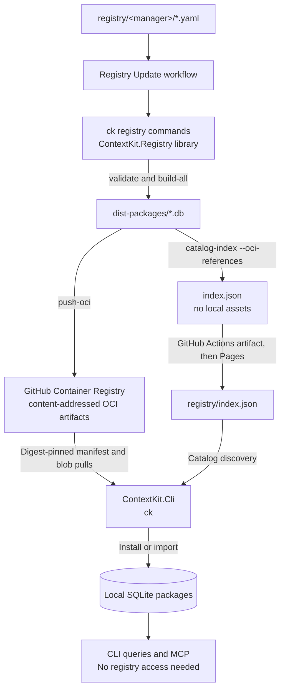
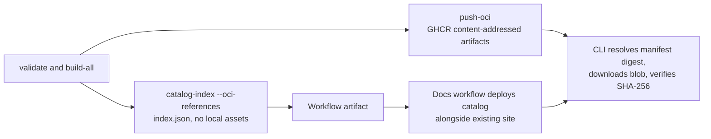

# ContextKit Registry Tooling

`ContextKit.Registry` implements the `ck registry` commands as a library.
Use it to validate community definitions, build SQLite documentation packages,
create bundles, and publish packages as content-addressed OCI artifacts.
It does not run an HTTP server.

## Which project to use

| Project | Responsibility | Entry point |
| --- | --- | --- |
| `ContextKit.Cli` | Install, inspect, query, and manage local packages; start MCP; expose maintainer commands. | `ck` |
| `ContextKit.Registry` | Read definitions and build, bundle, or publish artifacts. | `ck registry <command>` |

Building and bundling need no registry access. Publishing needs an OCI registry
such as GHCR. See the [CLI README](../ContextKit.Cli/README.md) for consumer
commands.

## Distribution flow

The workflow builds package files, not a running registry service. This diagram
shows the OCI artifact path, the catalog path, and the optional API path. The
Pages deployment is described below under public distribution.



| Stage | What happens | Who runs it |
| --- | --- | --- |
| Define | Contributors describe documentation sources in YAML and submit PRs. | Contributors and maintainers. |
| Build | `registry validate` checks definitions; `registry build-all` creates `.db` artifacts. | The current workflow, or a local maintainer. |
| Distribute | `registry push-oci` publishes `.db` artifacts to GHCR; the catalog ships as a workflow artifact and is deployed to Pages. | Workflow or maintainer. |
| Install | Install from the static catalog using `search-packages`, `download-package`, and `install`; those commands verify size and SHA-256 before import. | Consumer CLI. |
| Query | Read the installed SQLite package through `query` or MCP. | Consumer CLI and agents. |

The consumer needs no publishing credentials and no running service. After
installation, queries continue working offline.

### Which commands belong in GitHub Actions?

Yes: CI uses `ContextKit.Registry` through `ContextKit.Cli`, exactly as a
maintainer would. The [current workflow](../../.github/workflows/registry-update.yml)
already runs the build path:

```bash
dotnet run --project src/ContextKit.Cli --no-build --configuration Release -- \
  registry validate --dir registry
dotnet run --project src/ContextKit.Cli --no-build --configuration Release -- \
  registry build-all --dir registry --output ./dist-packages
```

The workflow also publishes every package to GHCR with `push-oci`, then runs
`catalog-index` and uploads the catalog as an Actions artifact. Uploading the
catalog alone does not enable named-package discovery; the docs workflow deploys
it to Pages. Choose the distribution path by target:

| Target | Registry commands | Upload or deployment step | Current status |
| --- | --- | --- | --- |
| OCI registry (GHCR) + Pages | `validate`, `build-all`, `push-oci`, `catalog-index` | Workflow pushes artifacts to GHCR and uploads `index.json`; docs workflow deploys it to Pages. | Implemented in the workflow; requires successful CI and Pages setup. |
| Actions artifacts | `validate`, `build-all` | `actions/upload-artifact` uploads `.db` files. | Available for ad-hoc transfers; not used for consumer distribution. |

Publish only from trusted, merged definitions on the default branch, never from
contributor PR jobs. Consumers configure the complete `registry/index.json` URL
and use the existing search and install commands. Published packages are never
attached to GitHub Releases, so releases stay free of hash-named assets.

## Run

```bash
dotnet tool install --global ContextKit
ck registry --help
```

During development, run the main CLI from the repository root:

```bash
./ck registry list --dir registry
```

```powershell
./ck.ps1 registry list --dir registry
dotnet run --project src/ContextKit.Cli -- registry validate --dir registry
```

There is no standalone executable or tool package for this library. CI runs
the same `ck registry` commands as contributors.

## Commands

Every command below follows `ck registry`. `<argument>` is required;
`[argument]` is optional.

| Command | Aliases | Behavior |
| --- | --- | --- |
| `list` | `l`, `ls` | List definitions and their source information. |
| `validate` | `v`, `val` | Validate definition syntax, required fields, and package identities. |
| `build <name> [version]` | `b` | Build one definition into a SQLite package. |
| `build-all` | `ba` | Build all definitions and declared versions; continue after failures and exit nonzero if any fail. |
| `bundle` | `bd`, `bun` | Archive built `.db` files with `index.json` and `SHA256SUMS`. |
| `import-bundle <path>` | `ib` | Extract a bundle into an artifact directory, without installing it in the local store. |
| `push-oci` | `po` | Push every built package to an OCI registry and write the digest-pinned reference map. |
| `catalog-index` | None | Generate static catalog metadata, either for OCI artifacts or for content-addressed asset copies. |

| Option | Alias | Applies to | Default |
| --- | --- | --- | --- |
| `--dir <path>` | `-d` | List, validate, build, push-oci, and catalog-index commands | `registry` |
| `--output <path>` | `-o` | Build, push-oci, bundle, import-bundle, and catalog-index commands | `./dist-packages` |
| `--format <format>` | `-f` | `bundle` | `zip`; also accepts `tar.gz` and `tgz` |
| `--destination <path>` | `-t` | `bundle`, `catalog-index` | Bundle archive path, or catalog directory (`./dist-catalog`). |
| `--oci-repository <host/path>` | None | `push-oci`, `catalog-index` | Target OCI repository; required by `push-oci`, for example `ghcr.io/owner/groundkit`. |
| `--oci-references <path>` | None | `push-oci`, `catalog-index` | Digest-pinned reference map. Written by `push-oci`, read by `catalog-index`. Default `oci-references.json`. |
| `--base-url <URL>` | None | `catalog-index` | HTTPS asset directory URL. Required only when no OCI target is supplied. |
| `--help` | `-h` | Any command | Show command help. |

## Build and inspect a package

The committed React definition is unversioned, so its artifact uses `latest`:

```bash
ck registry validate --dir registry
ck registry build react --dir registry --output ./dist-packages
ck import ./dist-packages/react@latest.db
ck inspect react
ck query react "useEffect cleanup"
```

`registry build` writes an artifact; `import` installs it. For a versioned
definition, pass a version declared in its YAML and import that version's file.

## Bundles and offline transfer

```bash
ck registry build-all --dir registry --output ./dist-packages
ck registry bundle --output ./dist-packages --format zip
ck registry bundle --output ./dist-packages --format tar.gz
ck registry import-bundle ./dist-packages/groundkit-registry.zip --output ./imported-packages
ck import ./imported-packages/react@latest.db
```

Bundles contain individual packages, an index, and checksums. Extracting a bundle
does not start a registry or install its packages automatically.

## Definition format

Unversioned source:

```yaml
name: react
description: "User interface library"
repository: https://github.com/reactjs/react.dev
source:
  type: git
  url: https://github.com/reactjs/react.dev
  docs_path: src/content
```

Versioned Git source:

```yaml
name: example
description: "Example library"
versions:
  - version: 1.0.0
    tag: v1.0.0
    source:
      type: git
      url: https://github.com/example/example
      docs_path: docs
  - version: 2.0.0
    tag: v2.0.0
    source:
      type: git
      url: https://github.com/example/example
      docs_path: docs
```

Place definitions under `registry/<manager>/`. The manager identifies the
package registry (`npm`, `pip`, `maven`, or `go`); `name` must match the filename
or nested path relative to that directory. Do not combine root `source` with
root `versions`. Pin Git refs for reproducible release builds.

Contributors can submit definitions through pull requests without hosting or
publishing credentials. See the [community registry guide](../../registry/README.md)
for manager-specific formats, exclusions, and contribution checks.

## Publish to an OCI registry

Publishing pushes each built SQLite package as a single-layer OCI manifest and
writes the digest-pinned reference map that `catalog-index` consumes:

| Environment variable | Purpose |
| --- | --- |
| `GROUNDKIT_OCI_USERNAME` | Registry username; falls back to `GITHUB_ACTOR`. |
| `GROUNDKIT_OCI_TOKEN` | Registry token or password; falls back to `GITHUB_TOKEN`. |
| `DOCKER_CONFIG` | Directory holding `config.json`; defaults to `~/.docker`. |

When neither variable is set, credentials come from the Docker credential file at
`$DOCKER_CONFIG/config.json`. That is the file `docker/login-action` writes, which
is why the Registry Update workflow logs in with `docker/login-action` instead of
exporting a token. Entries are matched by registry host, so a config holding
several registries never sends one host's token to another; credential stores and
helpers are not invoked.

```powershell
ck registry build-all --dir registry --output ./dist-packages
$env:GROUNDKIT_OCI_USERNAME = "<user>"
# Supply GROUNDKIT_OCI_TOKEN through your environment or secret manager.
ck registry push-oci --dir registry --output ./dist-packages `
  --oci-repository ghcr.io/OWNER/REPOSITORY --oci-references ./oci-references.json
```

Building and bundling need no credentials. Keep tokens out of committed
configuration and contributor PR jobs. Consumer commands use `GROUNDKIT_REGISTRY_URL`
or project `RegistryUrl`.

## Public distribution status

The [Registry Update workflow](../../.github/workflows/registry-update.yml)
validates and builds definitions through the main CLI, then pushes every built
package to the GitHub Container Registry as a content-addressed OCI artifact
with `registry push-oci`. Each artifact is a single-layer OCI manifest, and the
layer is the SQLite package itself, so the registry stores packages as GB-scale
blobs addressed by digest rather than as Release assets.

The workflow then runs `registry catalog-index --oci-references` to generate
`index.json`, which addresses each package by manifest digest and omits local
asset copies. The catalog is uploaded as a workflow artifact. No GitHub Release
is created, so the repository's release list stays clean and no hash-named `.db`
files appear as downloadable assets.

The [Pages workflow](../../.github/workflows/deploy-docs.yml) runs after successful
registry updates. It builds the existing documentation site, downloads the newest
catalog artifact into `registry/index.json`, and deploys both together. Every
documentation deployment preserves the newest available catalog.



Generate a catalog locally for an OCI-backed snapshot:

```bash
GROUNDKIT_OCI_USERNAME=<user> GROUNDKIT_OCI_TOKEN=<token> \
  ck registry push-oci --dir registry --output ./dist-packages \
  --oci-repository ghcr.io/OWNER/REPOSITORY \
  --oci-references ./oci-references.json

ck registry catalog-index --dir registry --output ./dist-packages \
  --destination ./dist-catalog --oci-references ./oci-references.json
```

OCI mode writes only `index.json`; it does not create an `assets/` directory.
The generator reads identity/version from each SQLite manifest and matches it to
one definition. Unknown, ambiguous, or duplicate identities fail generation, and
a package missing from the reference map is a hard error, so a partially pushed
release cannot produce a catalog that points at artifacts which do not exist.
Each entry contains registry, name, version, description, an HTTPS manifest URL,
byte size, SHA-256, an `oci://` reference, and optional source commit. Schema
version is `1`.

Consumers set `RegistryUrl` or `GROUNDKIT_REGISTRY_URL` to the full deployed
`registry/index.json` URL. They use existing `search-packages`, `download-package`,
and `install` commands; the OCI download path resolves the single manifest layer,
checks the size, and verifies SHA-256 before import.

Enable Pages with the GitHub Actions source. Both workflows must be on the
default branch; all build/test gates must pass. No public catalog exists until a
Pages deployment succeeds. GHCR creates packages private on first publish, so a
one-time visibility flip per package is required before anonymous installs work.
This workflow does not create bundles.
