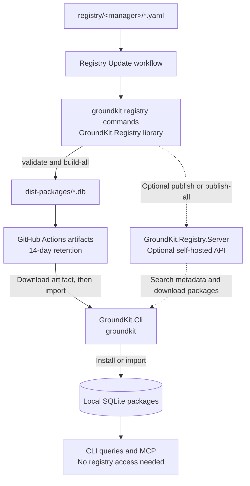
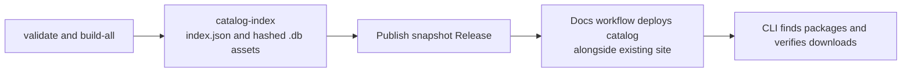

# GroundKit Registry Tooling

`GroundKit.Registry` implements the `groundkit registry` commands as a library.
Use it to validate community definitions, build SQLite documentation packages,
create bundles, and publish packages to an API. It does not run an HTTP server.

## Which project to use

| Project | Responsibility | Entry point |
| --- | --- | --- |
| `GroundKit.Cli` | Install, inspect, query, and manage local packages; start MCP; expose maintainer commands. | `groundkit` |
| `GroundKit.Registry` | Read definitions and build, bundle, or publish artifacts. | `groundkit registry <command>` |
| `GroundKit.Registry.Server` | Host registry search, metadata, downloads, and authenticated uploads. | Independent .NET application or Docker Compose. |

Building and bundling need no registry server. Publishing needs a compatible
API. See the [CLI README](../GroundKit.Cli/README.md) for consumer commands and
the [server README](../GroundKit.Registry.Server/README.md) for hosting.

## Distribution flow

The workflow builds package files, not a running registry service. This diagram
shows the Actions artifact path and optional API path. The Releases + Pages
deployment is described below under public distribution.



| Stage | What happens | Who runs it |
| --- | --- | --- |
| Define | Contributors describe documentation sources in YAML and submit PRs. | Contributors and maintainers. |
| Build | `registry validate` checks definitions; `registry build-all` creates `.db` artifacts. | The current workflow, or a local maintainer. |
| Distribute | Publish Release snapshots and Actions artifacts; optionally upload to a reachable registry API. | Workflow or maintainer. |
| Install | Import a downloaded artifact, or use `search-packages`, `download-package`, and `install` against the API. | Consumer CLI. |
| Query | Read the installed SQLite package through `query` or MCP. | Consumer CLI and agents. |

The optional server stores metadata in SQLite and artifacts in S3-compatible
storage. It receives built packages; it does not read definitions or build docs.
The consumer does not need publishing credentials. After installation, queries
continue working when the distribution service is offline.

### Which commands belong in GitHub Actions?

Yes: CI uses `GroundKit.Registry` through `GroundKit.Cli`, exactly as a
maintainer would. The [current workflow](../../.github/workflows/registry-update.yml)
already runs the build path:

```bash
dotnet run --project src/GroundKit.Cli --no-build --configuration Release -- \
  registry validate --dir registry
dotnet run --project src/GroundKit.Cli --no-build --configuration Release -- \
  registry build-all --dir registry --output ./dist-packages
```

The workflow also runs `catalog-index` and publishes a snapshot Release on
`main`. Uploading Actions artifacts alone does not enable named-package discovery.
Choose the distribution path by target:

| Target | Registry commands | Upload or deployment step | Current status |
| --- | --- | --- | --- |
| Actions artifacts | `validate`, `build-all` | `actions/upload-artifact` uploads `.db` files. | Implemented in the workflow; temporary distribution. |
| Optional self-hosted API | `validate`, `publish-all` | Tool builds packages and uploads them to the configured API. | Commands implemented; not enabled in the workflow. |
| GitHub Releases + Pages | `validate`, `build-all`, `catalog-index` | Registry workflow uploads a snapshot; docs workflow deploys its catalog alongside the site. | Implemented; requires successful CI and Pages setup. |

For API publishing, use `publish-all` in place of the `build-all` step. It builds
missing registry versions and uploads them; it does not merely upload every
existing file in the output directory. A workflow publishing step would look like:

```yaml
- name: Build and publish to optional registry API
  env:
    REGISTRY_SERVER_URL: ${{ vars.REGISTRY_SERVER_URL }}
    REGISTRY_PUBLISH_KEY: ${{ secrets.REGISTRY_PUBLISH_KEY }}
  run: |
    dotnet run --project src/GroundKit.Cli --no-build --configuration Release -- \
      registry publish-all --dir registry --output ./dist-packages
```

Configure both values before enabling this step. The API must be reachable from
the runner; `localhost` on a GitHub-hosted runner is not your self-hosted server.
Publish only from trusted, merged definitions, not contributor PR jobs.

For Releases + Pages, use the build and catalog commands plus GitHub upload and
deployment steps, not API `publish-all`. Consumers configure the complete
`registry/index.json` URL and use the existing search and install commands.

## Run

```bash
dotnet tool install --global GroundKit
groundkit registry --help
```

During development, run the main CLI from the repository root:

```bash
./groundkit registry list --dir registry
```

```powershell
./groundkit.ps1 registry list --dir registry
dotnet run --project src/GroundKit.Cli -- registry validate --dir registry
```

There is no standalone executable or tool package for this library. CI runs
the same `groundkit registry` commands as contributors.

## Commands

Every command below follows `groundkit registry`. `<argument>` is required;
`[argument]` is optional.

| Command | Aliases | Behavior |
| --- | --- | --- |
| `list` | `l`, `ls` | List definitions and their source information. |
| `validate` | `v`, `val` | Validate definition syntax, required fields, and package identities. |
| `build <name> [version]` | `b` | Build one definition into a SQLite package. |
| `build-all` | `ba` | Build all definitions and declared versions; continue after failures and exit nonzero if any fail. |
| `publish <name> [version]` | `p`, `pub` | Check the target API, skip an existing version, otherwise build and upload it. |
| `publish-all` | `pa` | Build and upload all declared versions, skipping existing ones; exit nonzero if any fail. |
| `bundle` | `bd`, `bun` | Archive built `.db` files with `index.json` and `SHA256SUMS`. |
| `import-bundle <path>` | `ib` | Extract a bundle into an artifact directory, without installing it in the local store. |
| `catalog-index` | None | Generate static catalog metadata and content-addressed Release asset copies. |

| Option | Alias | Applies to | Default |
| --- | --- | --- | --- |
| `--dir <path>` | `-d` | List, validate, build, publish, and catalog-index commands | `registry` |
| `--output <path>` | `-o` | Build, publish, bundle, import-bundle, and catalog-index commands | `./dist-packages` |
| `--format <format>` | `-f` | `bundle` | `zip`; also accepts `tar.gz` and `tgz` |
| `--destination <path>` | `-t` | `bundle`, `catalog-index` | Bundle archive path, or catalog directory (`./dist-catalog`). |
| `--base-url <URL>` | None | `catalog-index` | Required HTTPS asset directory URL for a Release snapshot. |
| `--help` | `-h` | Any command | Show command help. |

## Build and inspect a package

The committed React definition is unversioned, so its artifact uses `latest`:

```bash
groundkit registry validate --dir registry
groundkit registry build react --dir registry --output ./dist-packages
groundkit import ./dist-packages/react@latest.db
groundkit inspect react
groundkit query react "useEffect cleanup"
```

`registry build` writes an artifact; `import` installs it. For a versioned
definition, pass a version declared in its YAML and import that version's file.

## Bundles and offline transfer

```bash
groundkit registry build-all --dir registry --output ./dist-packages
groundkit registry bundle --output ./dist-packages --format zip
groundkit registry bundle --output ./dist-packages --format tar.gz
groundkit registry import-bundle ./dist-packages/groundkit-registry.zip --output ./imported-packages
groundkit import ./imported-packages/react@latest.db
```

Bundles contain individual packages, an index, and checksums. Extracting a bundle
does not start a registry or install its packages automatically.

## Definition format

Unversioned source:

```yaml
name: react
description: "User interface library"
repository: https://github.com/reactjs/react.dev
source:
  type: git
  url: https://github.com/reactjs/react.dev
  docs_path: src/content
```

Versioned Git source:

```yaml
name: example
description: "Example library"
versions:
  - version: 1.0.0
    tag: v1.0.0
    source:
      type: git
      url: https://github.com/example/example
      docs_path: docs
  - version: 2.0.0
    tag: v2.0.0
    source:
      type: git
      url: https://github.com/example/example
      docs_path: docs
```

Place definitions under `registry/<manager>/`. The manager identifies the
package registry (`npm`, `pip`, `maven`, or `go`); `name` must match the filename
or nested path relative to that directory. Do not combine root `source` with
root `versions`. Pin Git refs for reproducible release builds.

Contributors can submit definitions through pull requests without hosting or
publishing credentials. See the [community registry guide](../../registry/README.md)
for manager-specific formats, exclusions, and contribution checks.

## Publish to a self-hosted API

Start the separate [server](../GroundKit.Registry.Server/README.md), then
configure this tool's publishing client:

| Environment variable | Purpose |
| --- | --- |
| `REGISTRY_SERVER_URL` | Publishing API base URL; defaults to `http://localhost:8080`. |
| `REGISTRY_PUBLISH_KEY` | Required upload bearer token; must match the server configuration. |

```powershell
$env:REGISTRY_SERVER_URL = "http://localhost:8080"
# Supply REGISTRY_PUBLISH_KEY through your environment or secret manager.
groundkit registry publish react --dir registry --output ./dist-packages
```

Building and bundling do not need a publish key. Keep keys out of committed
configuration and contributor PR jobs. Consumer commands use `GROUNDKIT_REGISTRY_URL`
or project `RegistryUrl`, not `REGISTRY_SERVER_URL`.

## Public distribution status

The [Registry Update workflow](../../.github/workflows/registry-update.yml)
validates and builds definitions through the main CLI, then uploads `.db` files
as Actions artifacts retained for 14 days. On `main`, it also creates a Release
tagged `registry-<run-id>-<attempt>` containing content-addressed `.db` assets and
`index.json`. Assets are uploaded to a draft before it is published; the workflow
never overwrites published snapshot assets or marks registry snapshots as the
latest CLI release. Enable GitHub release immutability for platform enforcement.

The [Pages workflow](../../.github/workflows/deploy-docs.yml) runs after successful
registry updates. It builds the existing documentation site, copies the newest
published registry catalog into `registry/index.json`, and deploys both together.
Every documentation deployment preserves the catalog from the newest snapshot.



Generate a catalog locally using an intended snapshot asset URL:

```bash
groundkit registry catalog-index --dir registry --output ./dist-packages \
  --destination ./dist-catalog \
  --base-url https://github.com/OWNER/REPOSITORY/releases/download/registry-SNAPSHOT/
```

This creates `index.json` and an `assets/` directory; it does not upload files.
The generator reads identity/version from each SQLite manifest and matches it to
one definition. Unknown, ambiguous, or duplicate identities fail generation.
Each catalog entry contains registry, name, version, description, HTTPS download
URL, byte size, SHA-256, and optional source commit. Schema version is `1`.

Consumers set `RegistryUrl` or `GROUNDKIT_REGISTRY_URL` to the full deployed
`registry/index.json` URL. They use existing `search-packages`, `download-package`,
and `install` commands; static downloads reject size or checksum mismatches before
import. API URLs continue to use the optional self-hosted server.

Enable Pages with the GitHub Actions source and permit workflow Release writes.
Both workflows must be on the default branch; all build/test gates must pass.
No public catalog exists until a snapshot and subsequent Pages deployment succeed.
This workflow does not deploy a public API, create bundles, or upload OCI artifacts.
